# Continuous Delivery

## 1. Description

**Basic GitOps model with Jenkins and ArgoCD**

- The project's source code is stored in a separate repository, called the `source repo`
- The application deployment configuration (helmchart or k8s manifest files, etc.) is stored in a separate repository, called the `config repo`
- The CI/CD flow operates in a basic sequence as follows:
  - Dev commits source code
  - Jenkins builds the source code, performs CI steps, tests the code, etc.
  - Jenkins builds images
  - Jenkins pushes the image to the image registry
  - Jenkins updates the application version information in the deployment configuration files stored in the config repo
  - ArgoCD detects changes in the config repo and updates accordingly
  - ArgoCD compares the new configuration information with the current configuration on the system. If discrepancies are found, it will alert and synchronize according to the configuration declared and stored in the config repo

<div align="center">
  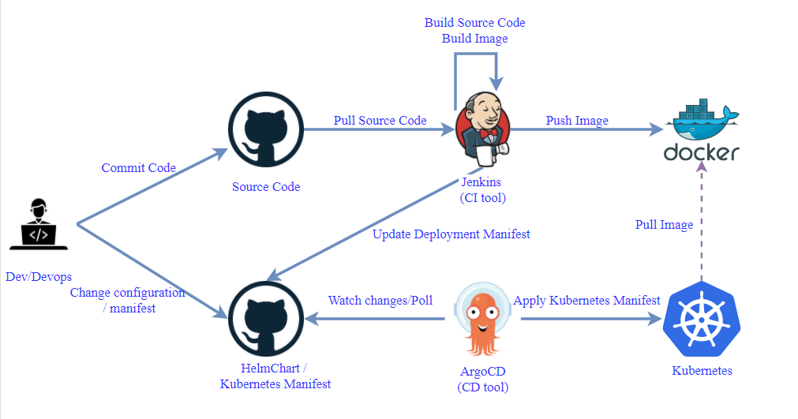
</div>

<div align="center">
  <i><a href=https://medium.com/@abhishek261291/cicd-using-jenkins-and-argocd-cb0b9fa63aa0>
         CICD using Jenkins and ArgoCD
</a></i>
</div>
<br>

## 2. Output

Resources deployed from the midterm project

- Server 1: **_CI/CD QA server (cicd-qa-server)_**: Memory: 3 GB, Processors: 1 – IP: `192.168.64.140`
  - Port `8080` - Jenkins server
  - Port `9000` - SonarQube server
- Server 2: **_Gitlab server (gitlab-server)_**: Memory: 3 GB, Processors: 1 – IP: `192.168.64.141`
- Server 3: **_App server 1 (app-server-1)_**: Memory: 1 GB, Processors: 1 – IP: `192.168.64.142`
- Server 4: **_Database server (database-server)_**: Memory: 1 GB, Processors: 1 – IP: `192.168.64.143`
- Server 5: **_App server 2 (app-server-2)_**: Memory: 1 GB, Processors: 1 – IP: `192.168.64.144`
- Server 6: **_Load balancing server (lb-server)_**: Memory: 1 GB, Processors: 1 – IP: `192.168.64.145`
- Server 7: Docker registry: using **_Docker Hub_**

Additional resources prepared for the final project:

- Server 8: **_k8s master server (k8s-master-server)_**: Memory: 2 GB, Processors: 1 – IP: `192.168.64.148`
- Server 9: **_k8s worker server (k8s-worker-server)_**: Memory: 2 GB, Processors: 2 – IP: `192.168.64.149`

<br>

ArgoCD has already been deployed on the cluster (see details [here](../helmChart-argocd/README.md))

Details of the midterm setup and CI/CD flow (see [here](https://github.com/quangtuanitmo18/Viettel-Digital-Talent-2024/tree/NguyenQuangTuan/midterm)) ensure that when a tag is created on the repo, the pipeline will run and push the image to Docker Hub through a manual step. The remaining task is to modify the config file and push it to the config repo for ArgoCD to detect and redeploy.

Credentials created on Jenkins for the pipeline:

- `gitlab-api-token`: token created by a user with admin rights on GitLab
- `gitlab-credential`: account with admin rights on GitLab
- `sonarqube-token`: token created by a user with admin rights on SonarQube
- `sonar-host-url`: URL to access the SonarQube server `192.168.64.140:9000`
- `vdt-midterm-web-project-key`: project key of the `vdt-midterm-web` project on SonarQube
- `vdt-midterm-api-project-key`: project key of the `vdt-midterm-api` project on SonarQube
- `dockerhub-credential`: Docker Hub account
- `telegram-token`: token created by `BotFather` on Telegram
- `telegram-chatId`: chat ID of the bot chat on Telegram
- `ip-gitlab-server`: `192.168.64.141`
- `vdt-midterm-api-env`: environment file for the production environment of the `web` service
- `vdt-midterm-web-env`: environment file for the production environment of the `api` service

**_Below is the CI/CD pipeline for the `api` service; the pipeline for the `web` service is similar_**

- `def sendTelegramMessage(token, chatId, message)`: This function sends a message to Telegram

  - `sh`: Executes a curl command to send a message via the Telegram API

- `pipeline`

  - `agent any`: Specifies that this pipeline can run on any Jenkins agent
  - `environment`: Declares the necessary environment variables for the pipeline
  - `stages`: Contains the specific steps involved in the pipeline process

    - **Stage `Prepare pipeline`:** Sends a Telegram message to notify the start of the build
    - **Stage `Checkout source`:** Copies the source code into the project folder and modifies ownership and permissions
    - **Stage `Test with SonarQube`:** Executes source code analysis with SonarQube to assess code quality
    - **Stage `Check lint and prettier`:** Installs npm dependencies and runs linting and formatting checks using Prettier
    - **Stage `Unit test with Jest`:** Reads the environment file and runs unit tests with Jest
    - **Stage `Build and push image`:**
      - Checks if the commit has a tag. If true, prompts the user to confirm building and pushing the Docker image to Docker Hub.
      - If the user selects "Yes", it builds and pushes the Docker image to Docker Hub.
    - **Stage `Update version image in helm chart`:**
      - Checks if the commit has a tag. If true, prompts the user to confirm updating the image version in the values file in the config repository.
      - If the user selects "Yes", it updates the image version in the config repository.

  - `post`: Sends a Telegram notification based on the pipeline result:
    - **`success`:** Sends a success message
    - **`failure`:** Sends a failure message
    - **`aborted`:** Sends a message if the pipeline is aborted

```shell
def sendTelegramMessage(token, chatId, message) {
    sh """
    curl -s -X POST https://api.telegram.org/bot${token}/sendMessage -d chat_id=${chatId} -d text="${message}"
    """
}

pipeline{
    agent any
    environment{
        PATH_PROJECT = '/home/projects/VDT-midterm-api'
        PATH_CONFIG_PROJECT = '/home/projects/VDT-config/VDT-config-helm-api'

        SONAR_PROJECT_KEY = credentials('vdt-midterm-api-sonar-project-key')
        SONAR_TOKEN = credentials('sonarqube-token')
        SONAR_HOST_URL= credentials('sonar-host-url')

        IP_GITLAB_SERVER = credentials('ip-gitlab-server')
        NAME_REPO_CONFIG = 'vdt-config-helm-api'

        DOCKER_HUB ='tuanquang1811'
        DOCKER_HUB_CREDENTIALS = credentials('dockerhub-credentials')
        NAME_API = 'vdt-midterm-api'
        DOCKER_TAG = "${GIT_BRANCH.tokenize('/').pop()}-${GIT_COMMIT.substring(0,7)}"

        ENV_FILE_VDT_MIDTERM_API = ''

        TELEGRAM_TOKEN = credentials('telegram-token')
        TELEGRAM_CHAT_ID = credentials('telegram-chatId')
        TEXT_PRE_BUILD = "Jenkins is building ${JOB_NAME}"

    }
    stages{

        stage("Prepare pipeline") {
            steps {
                script {
                    sendTelegramMessage(TELEGRAM_TOKEN, TELEGRAM_CHAT_ID, TEXT_PRE_BUILD)
                }
            }
        }

        stage('Checkout source' ){
            steps{
                sh "sudo cp -r . $PATH_PROJECT \
                && sudo chown -R jenkins:jenkins $PATH_PROJECT \
                && sudo chmod -R 755  $PATH_PROJECT \
                "
            }
        }
        stage('Test with sonarqube'){
            steps{
                withSonarQubeEnv('sonarqube connection') {
                    sh "cd $PATH_PROJECT && docker run --rm \
                    -e SONAR_HOST_URL=${SONAR_HOST_URL} \
                    -e SONAR_SCANNER_OPTS='-Dsonar.projectKey=${SONAR_PROJECT_KEY}' \
                    -e SONAR_TOKEN=${SONAR_TOKEN} \
                    -v '.:/usr/src' \
                    sonarsource/sonar-scanner-cli"
                }
            }
        }
        stage('Check lint and prettier'){
            steps{
              sh "cd $PATH_PROJECT && npm install && npm run lint && npm run prettier"
            }
        }
        stage('Unit test with Jest'){
            steps{
              script{
                 withCredentials([file(credentialsId: 'vdt-midterm-api-env', variable: 'ENV_FILE_VDT_MIDTERM_API')]) {
                                ENV_FILE_VDT_MIDTERM_API = readFile(file:"$ENV_FILE_VDT_MIDTERM_API").trim()
                }
                sh "echo \"$ENV_FILE_VDT_MIDTERM_API\" > $PATH_PROJECT/.env.production"
                sh "cd $PATH_PROJECT && npm run test:prod"
              }
            }
        }
        stage('Build and push image'){
           when {
                expression {
                     return sh(script: 'git describe --exact-match --tags HEAD', returnStatus: true) == 0
                }
            }
            steps{
                script {
                    try {
                        timeout(time: 3, unit: 'MINUTES') {
                            env.userChoice = input message: 'Do you want to build and push image to docker hub?',
                                parameters: [choice(name: 'Versioning service', choices: 'Yes\nNo', description: 'Choose "Yes" if you want to build and push image to docker hub')]
                        }
                        if(env.userChoice == 'Yes') {

                            env.IMAGE_TAG = DOCKER_TAG
                            sh " cd $PATH_PROJECT \
                            && IMAGE_TAG=${IMAGE_TAG} \
                            && NAME_API=${NAME_API} \
                            && docker-compose build --parallel \
                            && docker tag ${NAME_API}:$DOCKER_TAG ${DOCKER_HUB}/${NAME_API}:$DOCKER_TAG \
                            && echo $DOCKER_HUB_CREDENTIALS_PSW | docker login -u $DOCKER_HUB_CREDENTIALS_USR --password-stdin \
                            && docker push ${DOCKER_HUB}/${NAME_API}:$DOCKER_TAG \
                            && docker rmi  ${DOCKER_HUB}/${NAME_API}:$DOCKER_TAG "
                        } else {
                            echo "build and push image to docker hub cancelled"
                        }
                    } catch(Exception err) {
                        def user = err.getCauses()[0].getUser()
                        if('SYSTEM' == user.toString()) {
                            def didTimeout = true
                            echo "Timeout. Build and push image to docker hub cancelled"
                        } else {
                            echo "Build and push image to docker hub cancelled by: ${user}"
                        }
                    }
                }
            }
        }
        stage('Update version image in helm chart'){
            when {
                expression {
                     return sh(script: 'git describe --exact-match --tags HEAD', returnStatus: true) == 0
                }
            }
            steps{
                script{
                    try {
                        timeout(time: 3, unit: 'MINUTES') {
                            env.userChoice = input message: 'Do you want to update version image in helm chart?',
                                parameters: [choice(name: 'Versioning service', choices: 'Yes\nNo', description: 'Choose "Yes" if you want to update version image in helm chart')]
                        }
                        if(env.userChoice == 'Yes') {
                            withCredentials([usernamePassword(credentialsId: 'gitlab-credentials', usernameVariable: 'GIT_USERNAME', passwordVariable: 'GIT_PASSWORD')]) {
                                sh """
                                    rm -rf ${PATH_CONFIG_PROJECT}

                                    # Clone the repository
                                    git clone http://${GIT_USERNAME}:${GIT_PASSWORD}@${IP_GITLAB_SERVER}/tuanmaintainer/${NAME_REPO_CONFIG}.git ${PATH_CONFIG_PROJECT}
                                    cd ${PATH_CONFIG_PROJECT}

                                    # Update the version in the values file
                                    sed -i 's/tag:.*/tag: ${DOCKER_TAG}/' values.yaml

                                    # Commit and push the changes
                                    git config user.name "${GIT_USERNAME}"
                                    git config user.email "${GIT_USERNAME}@git-server.com"
                                    git add .
                                    git commit -m "Update version to ${DOCKER_TAG}"
                                    git push origin main
                                """
                            }
                        } else {
                            echo "deploy cancelled"
                        }
                    }
                    catch(Exception err) {
                        def user = err.getCauses()[0].getUser()
                        if('SYSTEM' == user.toString()) {
                            def didTimeout = true
                            echo "Timeout. update version image in helm chart cancelled"
                        } else {
                            echo "Update version image in helm chart cancelled by: ${user}"
                        }
                    }
                }
            }

        }
    }
    post{
        success {
            sendTelegramMessage(TELEGRAM_TOKEN, TELEGRAM_CHAT_ID, "JOB ${JOB_NAME} is Success")
        }
        failure {
            sendTelegramMessage(TELEGRAM_TOKEN, TELEGRAM_CHAT_ID, "JOB ${JOB_NAME} is Failure")
        }
        aborted {
            sendTelegramMessage(TELEGRAM_TOKEN, TELEGRAM_CHAT_ID, "JOB ${JOB_NAME} is Aborted")
        }
    }

}
```

The `.env.production` file of the `api` service deployed on k8s ([repo link](https://github.com/quangtuanitmo18/VDT-midterm-api))

```shell
# APP
HOST=http://192.168.64.149:30003/api
PORT=4000
CLIENT_URL=http://192.168.64.149:30002

# DB
DB_NAME=vdt-final
DB_NAME_TEST=vdt-final-test
DB_USERNAME=mongo_user
DB_PASSWORD=mongo_password
DB_HOST=vdt-db-0.vdt-db.vdt-final.svc.cluster.local
DB_HOST_TEST=192.168.64.143
DB_PORT=27017

#JWT
ACCESS_TOKEN_EXPIRES_IN='1d'
REFRESH_TOKEN_EXPIRES_IN='3d'
PASSWORD_SECRET='tuanquang!@#123'
JWT_SECRET='SECRET!@#123'
JWT_SECRET_ACCESS_TOKEN='SECRET!@#123456_ACCESS'
JWT_SECRET_REFRESH_TOKEN='SECRET!@#123456_REFRESH'

```

The `.env` file of the `web` service deployed on k8s ([repo link](https://github.com/quangtuanitmo18/VDT-midterm-web))

```shell
VITE_API_URL="http://192.168.64.149:30003"
```

<br>

### 2.1 Demo Images

**Demo images for the `pipeline-vdt-midterm-api` pipeline**

Create a tag on the main branch of the `VDT-midterm-api` repo. At this point, the `Build and push image` and `Update version image in helm chart` stages can be executed through a manual step to confirm whether to perform these two stages (Continuous Delivery).

<div align="center">
  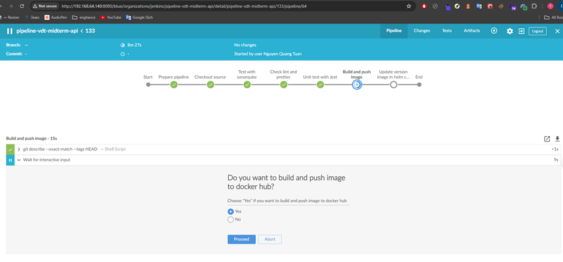
</div>
<div align="center">
  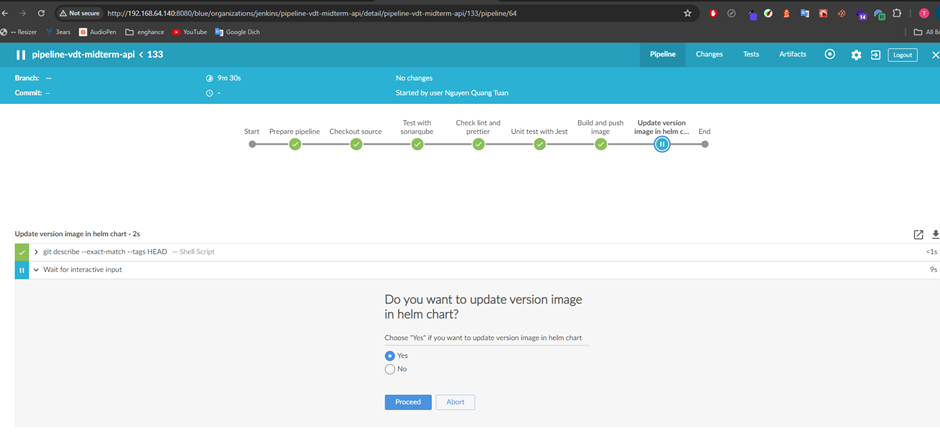
</div>
<div align="center">
  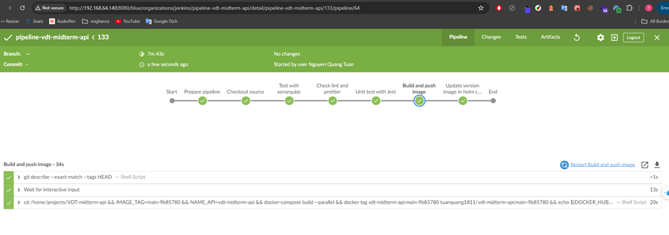
</div>

SonarQube code analysis

<div align="center">
  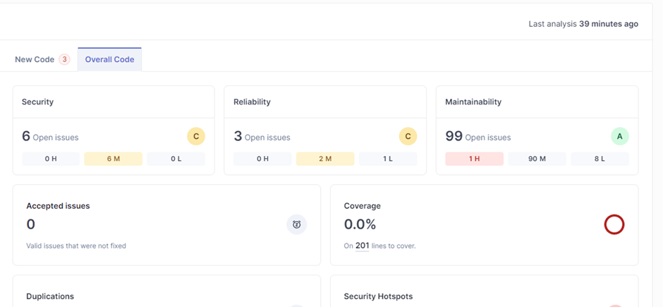
</div>
<br>

Image pushed to Docker Hub

<div align="center">
  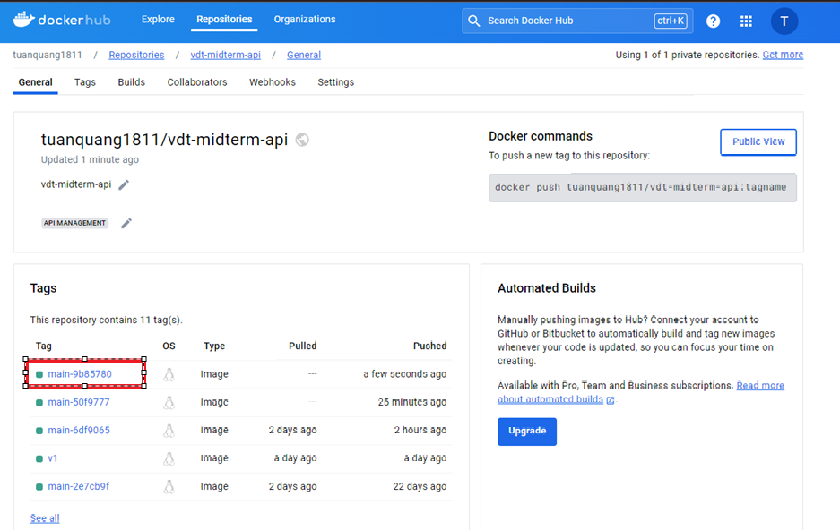
</div>
<br>

Docker image version updated in the config repo

<div align="center">
  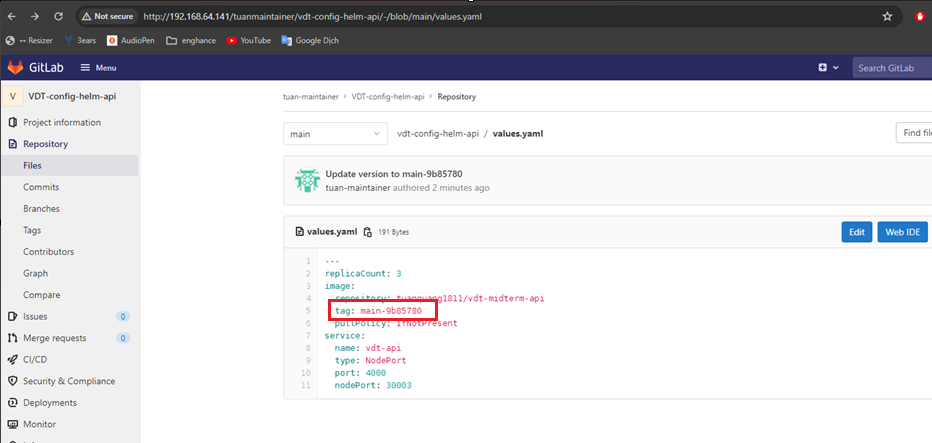
</div>
<br>

Receive notification on Telegram

<div align="center">
  
</div>
<br>

ArgoCD detects changes in the values file of the `VDT-config-helm-api` config repo

<div align="center">
  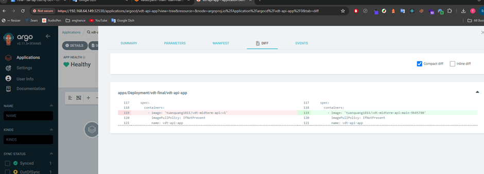
</div>
<br>

Events in the `vdt-api-app` application on ArgoCD

<div align="center">
  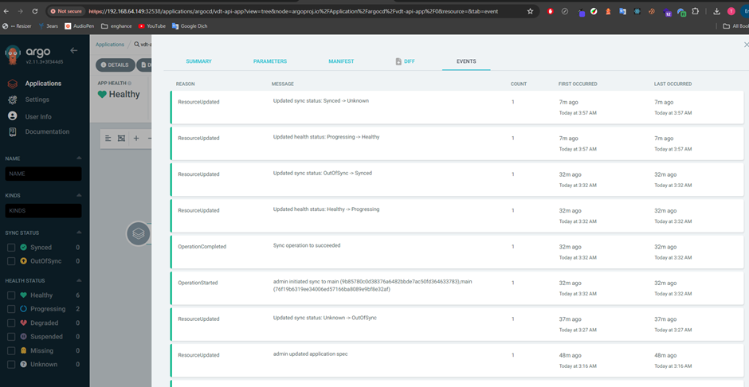
</div>
<br>

Now just sync, and the new version will be deployed on the cluster

<div align="center">
  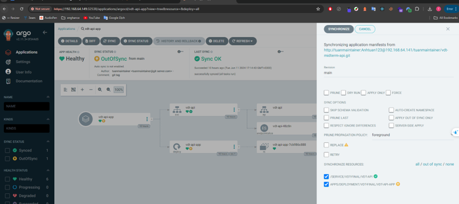
</div>
<br>

<br>

**Demo images for the `pipeline-vdt-midterm-web` pipeline**

Create a tag on the main branch of the `VDT-midterm-web` repo. At this point, the `Build and push image` and `Update version image in helm chart` stages can be executed through a manual step to confirm whether to perform these two stages (Continuous Delivery).

<div align="center">
  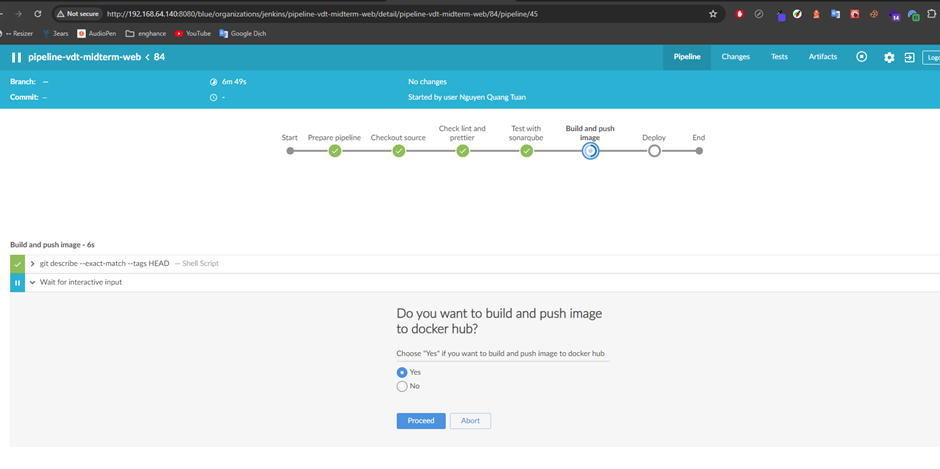
</div>
<div align="center">
  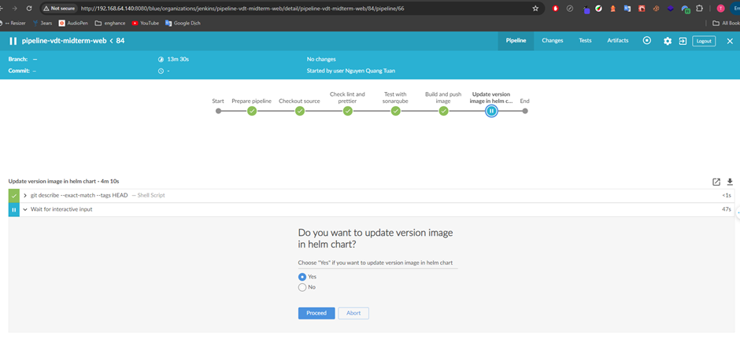
</div>
<div align="center">
  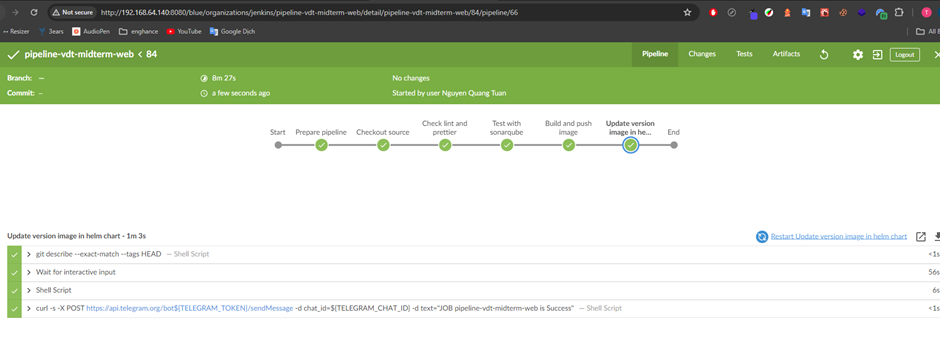
</div>

SonarQube code analysis

<div align="center">
  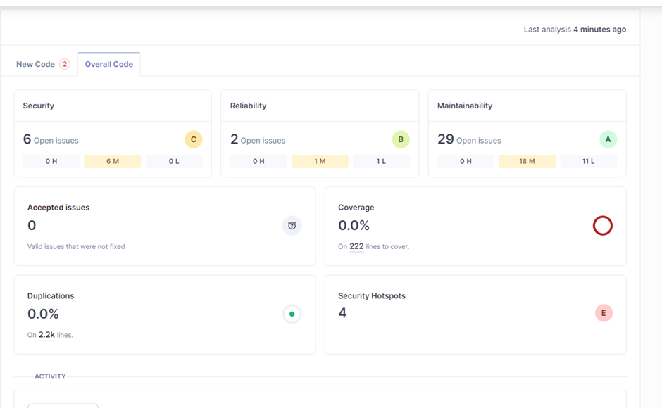
</div>
<br>

Image pushed to Docker Hub

<div align="center">
  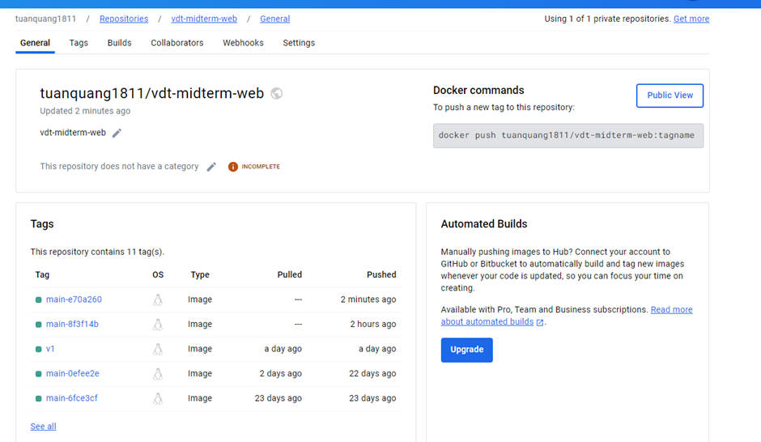
</div>
<br>

Docker image version updated in the config repo

<div align="center">
  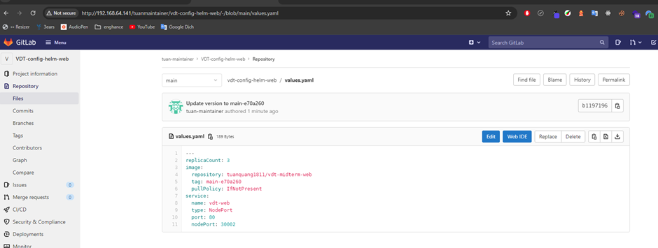
</div>
<br>

Receive notification on Telegram

<div align="center">
  
</div>
<br>

ArgoCD detects changes in the values file of the `VDT-config-helm-api` config repo

<div align="center">
  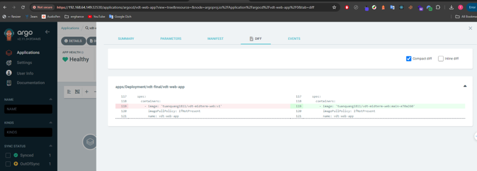
</div>
<br>

Events in the `vdt-api-app` application on ArgoCD

<div align="center">
  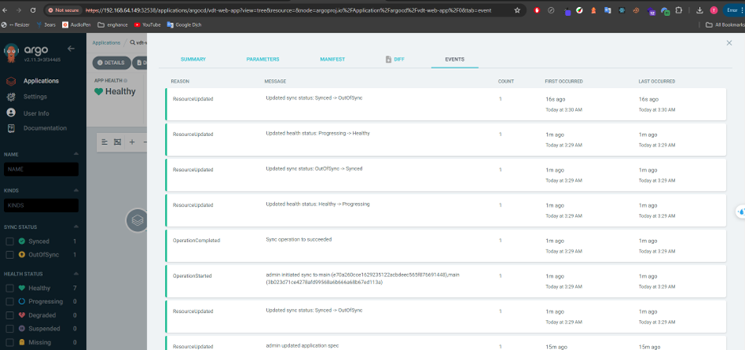
</div>
<br>

Now just sync, and the new version will be deployed on the cluster

<div align="center">
  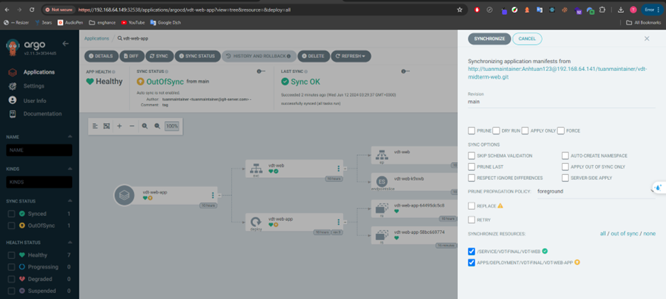
</div>
<br>
