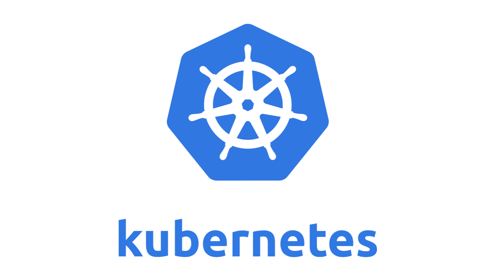
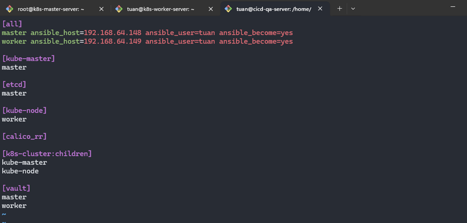
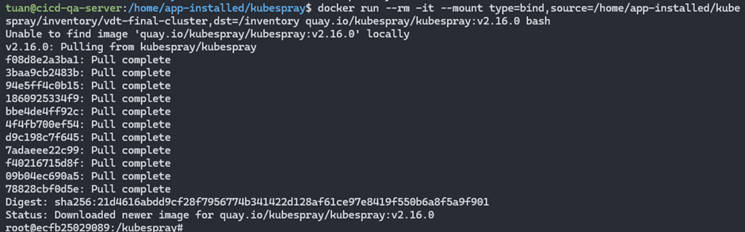
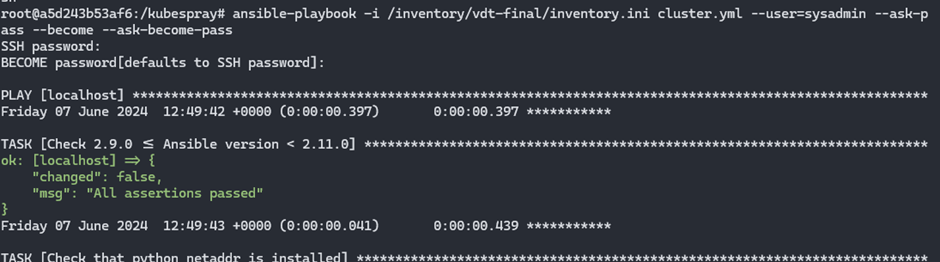
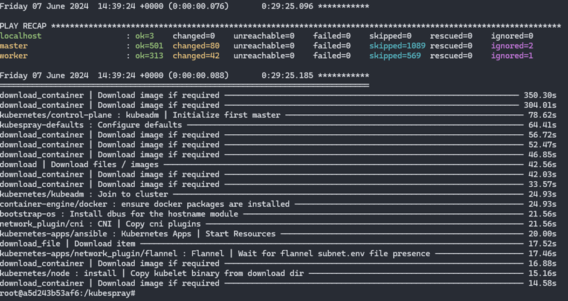
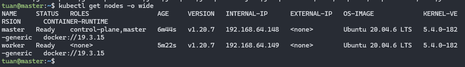
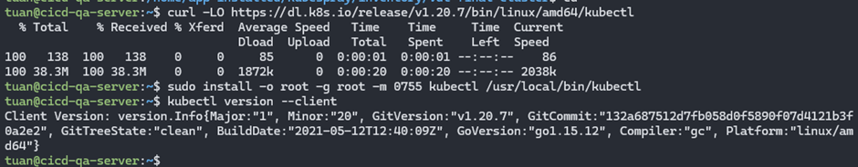
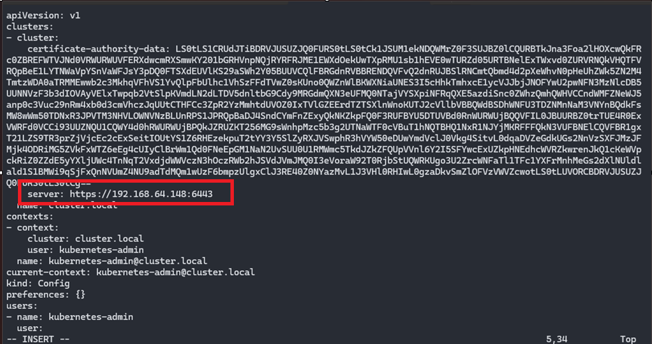
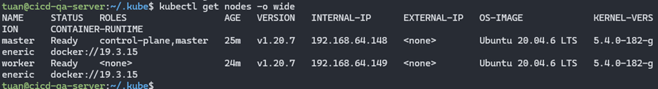

# Kubernetes

## 1. Description

**Kubernetes**, often referred to as K8s, is an open-source system for automating the deployment, scaling, and management of containerized applications. Developed by Google and now maintained by the Cloud Native Computing Foundation (CNCF), Kubernetes provides a platform to operate containerized applications in a cluster of nodes. The main components of Kubernetes include:

- Cluster: A set of machines (nodes) running containerized applications.
- Nodes: The machines in the cluster, which can be physical or virtual, where containers run.
- Pods: The smallest unit in Kubernetes, a Pod can contain one or more containers.
- Services: Define how to access a group of Pods.
- Ingress: Manages external access to services in the cluster, typically via HTTP and HTTPS.

<div align="center">
  
</div>

<div align="center">
  <i><a href=https://kubernetes.io/vi/docs/concepts/overview/what-is-kubernetes/>
         K8S
        </a></i>
</div>
<br>

**Kubectl** is the command-line tool for interacting with Kubernetes. It allows you to perform operations such as deploying applications, managing resources, checking logs, etc. Some common kubectl commands include:

`kubectl apply -f <file.yaml>`: Apply configuration from a YAML file.
`kubectl get <resource>`: List resources (pods, services, deployments, etc.).
`kubectl describe <resource> <name>`: Show details about a specific resource.
`kubectl logs <pod>`: View logs of a Pod.

**Kubelet** is an agent that runs on each node in the cluster and is responsible for the Pods assigned to that node. It ensures that the containers in a Pod are running. Kubelet receives instructions from the API server and executes them, managing the lifecycle of containers through container runtimes like Docker or containerd.

**Kubespray** is an open-source project that provides Ansible playbooks to deploy a Kubernetes cluster. Designed to be easy and flexible, Kubespray supports various operating systems and cloud environments. It offers features such as:

- Multi-node deployment.
- High availability.
- Network plugin support.
- Cluster upgrades.

## 2. Output

### 2.1 Resource Preparation

Resources from the midterm project have been deployed

- Server 1: **_CI/CD QA server (cicd-qa-server)_**: Memory: 3 GB, Processors: 1 – IP: `192.168.64.140`
  - Port `8080` - Jenkins server
  - Port `9000` - Sonarqube server
- Server 2: **_Gitlab server (gitlab-server)_**: Memory: 3 GB, Processors: 1 – IP: `192.168.64.141`
- Server 3: **_App server 1 (app-server-1)_**: Memory: 1 GB, Processors: 1 – IP: `192.168.64.142`
- Server 4: **_Database server (database-server)_**: Memory: 1 GB, Processors: 1, Disk: 20 GB – IP: `192.168.64.143`
- Server 5: **_App server 2 (app-server-2)_**: Memory: 1 GB, Processors: 1 – IP: `192.168.64.144`
- Server 6: **_Load balancing server (lb-server)_**: Memory: 1 GB, Processors: 1 – IP: `192.168.64.145`
- Server 7: Docker registry: using **_Docker Hub_**

To deploy K8s in this project, additional resources are needed:

- Server 8: **_k8s master server (k8s-master-server)_**: Memory: 2 GB, Processors: 1 – IP: `192.168.64.148`
- Server 9: **_k8s worker server (k8s-worker-server)_**: Memory: 2 GB, Processors: 2 – IP: `192.168.64.149`

### 2.2 Installing k8s via Kubespray

In this section, Kubernetes will be deployed using the kubespray tool on 1 master node VM + 1 worker node VM.

The idea is to install kubespray on a server (Installation Server), in this lab, the node `cicd-qa-server` is chosen, and kubespray needs to know how many master nodes, worker nodes, and etcd nodes to install, and the connection information of these nodes.

Clone Kubespray from GitHub
`git clone https://github.com/kubernetes-sigs/kubespray.git --branch release-2.16`

Create a new inventory from the kubespray sample
`cp -rf inventory/sample inventory/vdt-final-cluster`

Configure the inventory file. In the [all] section, declare detailed information of all nodes including names and IPs. [kube-master] are the nodes that will run with the master role, [kube-node] are the nodes running the worker role, [etcd] are the nodes that will run etcd, usually chosen as the master nodes.

<div align="center">
  
</div>
<br>

Next, if you want to change the CNI (network plugin of K8S), edit the following config file:
`inventory/vdt-final-cluster/group_vars/k8s_cluster/k8s-cluster.yml`
change the parameter `kube_network_plugin` from `calico` to `flannel` (details about these two network plugins can be found [here](https://www.suse.com/c/rancher_blog/comparing-kubernetes-cni-providers-flannel-calico-canal-and-weave/))

Since Kubespray uses Ansible, create an ssh key and push it to the two nodes `k8s-master-server` and `k8s-worker-server`.

Run Kubespray from a container to install the k8s cluster
`docker run -it --mount type=bind,source=/home/app-installed/kubespray/inventory/vdt-final-cluster,dst=/inventory/vdt-final quay.io/kubespray/kubespray:v2.16.0 bash`

<div align="center">
  
</div>
<br>

Now install k8s via Ansible
`ansible-playbook -i /inventory/vdt-final/inventory.ini cluster.yml --user=sysadmin --ask-pass --become --ask-become-pass`

<div align="center">
  
</div>

<div align="center"> 
  
</div>
<br>

### 2.3 Installing and Configuring kubectl

**Configure kubectl on the master**

```shell
mkdir -p $HOME/.kube
sudo cp /etc/kubernetes/admin.conf $HOME/.kube/config
sudo chown $(id -u):$(id -g) $HOME/.kube/config
```

Run `kubectl get nodes -o wide` to list the nodes

<div align="center"> 
  
</div>
<br>

**Configure kubectl on `cicd-qa-server`**
Install kubectl on this server

```shell
curl -LO https://dl.k8s.io/release/v1.20.7/bin/linux/amd64/kubectl
sudo install -o root -g root -m 0755 kubectl /usr/local/bin/kubectl
kubectl version --client
```

<div align="center"> 
  
</div>
<br>

Configure kubectl to connect to the K8S cluster:

```shell
mkdir -p $HOME/.kube
scp tuan@192.168.64.148:~/.kube/config  $HOME/.kube/
chown $(id -u):$(id -g) $HOME/.kube/config
```

<br>

Edit the config file, change the parameter "server: https://127.0.0.1:6443" to "server: https://192.168.64.148:6443" and save it (`192.168.64.148` is the IP of the master node, 6443 is the default port of the kube-api-server)

<div align="center"> 
  
</div>
<br>
Then get the nodes 
<div align="center"> 
  
</div>
