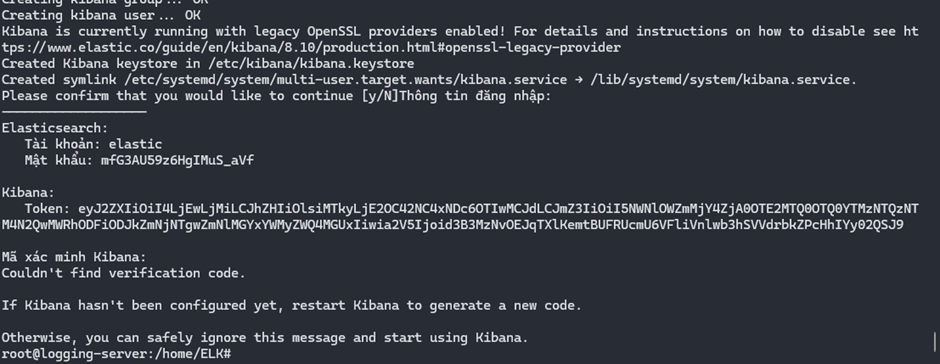
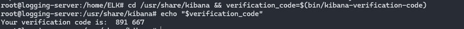
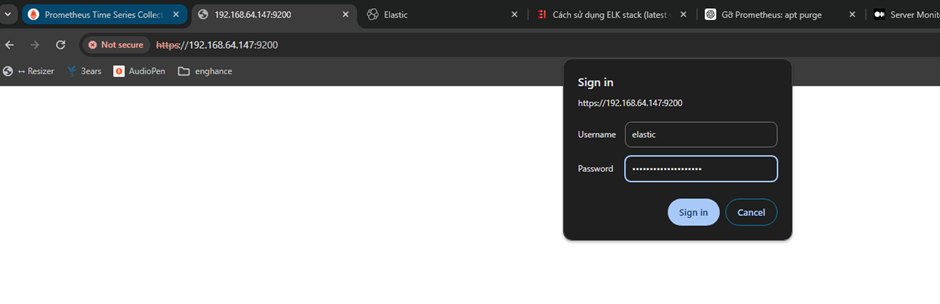
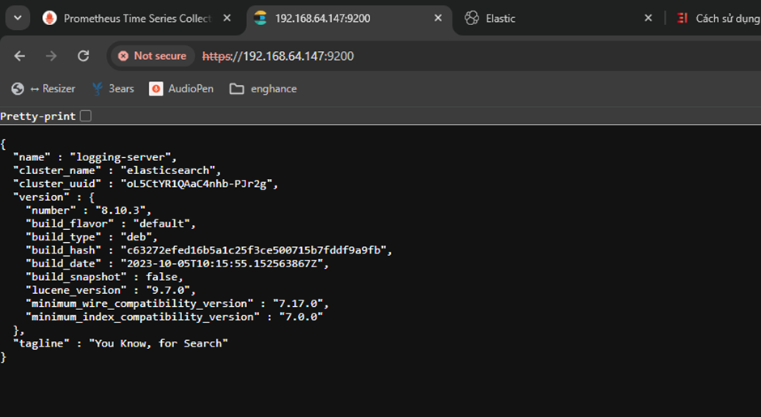
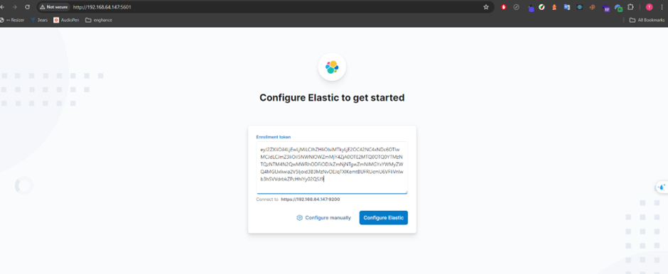
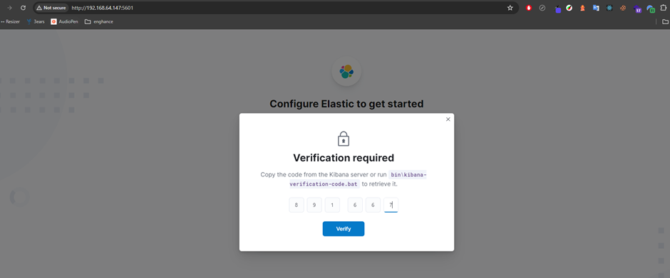
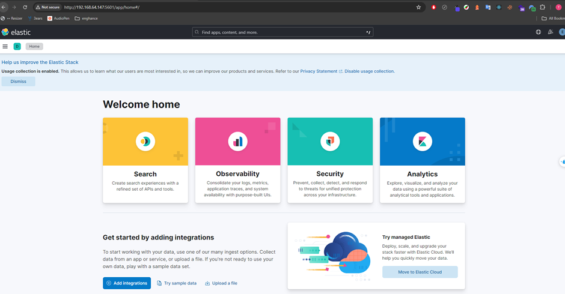

# Logging

## 1. Mô tả

ELK Stack là một bộ công cụ mã nguồn mở mạnh mẽ được sử dụng phổ biến cho việc thu thập, phân tích và hiển thị dữ liệu log trong hệ thống. ELK Stack bao gồm ba thành phần chính: Elasticsearch, Logstash, và Kibana. Khi thêm Beats, bộ công cụ này còn được gọi là Elastic Stack.

Các thành phần của ELK Stack

- Elasticsearch: Là một công cụ tìm kiếm và phân tích phân tán dựa trên Apache Lucene. Nó cung cấp khả năng tìm kiếm toàn văn bản, lưu trữ và phân tích dữ liệu thời gian thực.
  Chức năng: Lưu trữ và quản lý các logs, cho phép truy vấn và tìm kiếm dữ liệu một cách nhanh chóng và hiệu quả.
- Logstash: Là một công cụ thu thập và xử lý logs. Logstash có khả năng nhận logs từ nhiều nguồn khác nhau, xử lý và chuyển tiếp chúng đến Elasticsearch hoặc các hệ thống lưu trữ khác.
  Chức năng: Thu thập, xử lý và chuyển tiếp dữ liệu log. Nó cho phép lọc, chuyển đổi và làm sạch dữ liệu log trước khi lưu trữ.
- Kibana: Là một công cụ trực quan hóa và khám phá dữ liệu được lưu trữ trong Elasticsearch.
  Chức năng: Cung cấp giao diện người dùng để tạo ra các biểu đồ, dashboard và báo cáo dựa trên dữ liệu log. Kibana giúp người dùng phân tích và giám sát dữ liệu một cách trực quan.
- Beats: Là một bộ các lightweight data shippers để gửi logs, metrics và dữ liệu từ các máy chủ và containers đến Logstash hoặc Elasticsearch.
  Chức năng: Thu thập và gửi dữ liệu từ các hệ thống khác nhau đến Logstash hoặc Elasticsearch để xử lý và lưu trữ.

## 2. Output

[Cài đặt ELK stack](./assets/scripts/setup-elk.sh)

Cài đặt thành công sẽ nhận được

  

 

  

 

Truy cập vào ElastichSearch

  

 

  

 

Truy cập vào kibana

  

 

  

 

  

 
