# Monitoring

## 1. Description

Monitoring is the process of collecting, analyzing, and using data about a system or application to ensure it operates correctly and efficiently. The goals of monitoring include:

- Early detection of issues: Identifying problems before they affect users or cause significant damage.
- Performance optimization: Ensuring the system or application operates optimally.
- Data-driven decision making: Providing accurate information to help manage and develop the system better.
- Ensuring availability: Ensuring services are always available to users.

The basic components of a monitoring system include:

- Metrics: Measurement data from the system (such as CPU usage, memory usage, request rate).
- Logs: Detailed data about events occurring in the system.
- Alerts: Notifications when issues or abnormal conditions occur.

Prometheus is an open-source monitoring and alerting system initially developed by SoundCloud. Prometheus is designed to collect and store real-time metrics in a time-series database. It supports a powerful query language for data analysis. Here is how Prometheus works:

- Scraping: Prometheus periodically collects data from configured endpoints (called targets) via HTTP. These endpoints must provide metrics data in the Prometheus exposition format.
- Storage: Prometheus stores metrics data in its time-series database.
- Querying: Users can use PromQL, Prometheus's query language, to query and analyze metrics data.
- Alerting: Prometheus integrates with Alertmanager to send alerts based on user-defined conditions.
- Visualization: Prometheus can be integrated with tools like Grafana to display metrics data as charts and dashboards.

<div align="center">
  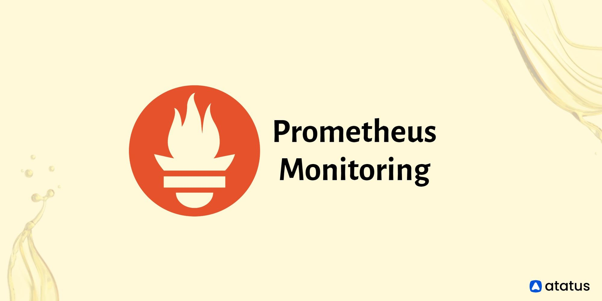
</div>

<div align="center">
  <i><a href=https://www.atatus.com/glossary/prometheus-monitoring/>
         Prometheus monitoring
        </a></i>
</div>
<br>

## 2. Output

### 2.1 Expose metrics of web and api services

For the Api service, since it runs on a server, exposing metrics only requires installing some additional packages. In this lab, [prom-client](https://www.npmjs.com/package/prom-client) is used.

Install and implement the package on the Nodejs Api server.

<div align="center">
  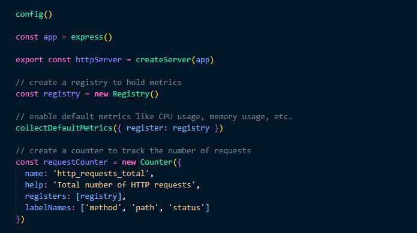
</div>
<br>

For the Web service, an additional sidecar container ([Nginx prometheus exporter](https://github.com/nginxinc/nginx-prometheus-exporter)) is needed.

The Sidecar Container pattern is often used in containerized applications to add functionality without modifying the main application. In this case, Nginx is used as the web server for Reactjs, and a Prometheus Exporter is used to expose metrics from Nginx, allowing Prometheus to collect them.

The web service runs on the Nginx web server. Below is the Nginx configuration file.

<div align="center">
  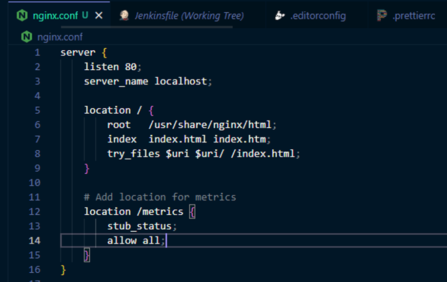
</div>
<br>

Update the helm-chart (service, deployment) and values file in the config repo:

- `api`: Add labels and port names to allow the service monitor to detect the api service (see PRs [vdt-midterm-api/update-helm-chart](https://github.com/quangtuanitmo18/VDT-midterm-api/pull/9/files), [vdt-config-helm-api/update-values](https://github.com/quangtuanitmo18/VDT-config-helm-api/pull/1))
- `web`: Add labels and port names to allow the service monitor to detect the web service and add a sidecar container `Nginx prometheus exporter` to capture web metrics (see PRs [vdt-midterm-web/update-helm-chart](https://github.com/quangtuanitmo18/VDT-midterm-web/pull/7/files), [vdt-config-helm-web/update-values](https://github.com/quangtuanitmo18/VDT-config-helm-web/pull/1))

### 2.2 Deploy Prometheus on the K8s cluster

Installing Prometheus on Kubernetes via Prometheus Operator is a more flexible and powerful approach compared to using Helm directly. Prometheus Operator provides Custom Resource Definitions (CRDs) and Controllers to manage and configure Prometheus components on Kubernetes.

Run the following commands to install Prometheus Operator:

<div align="center">
  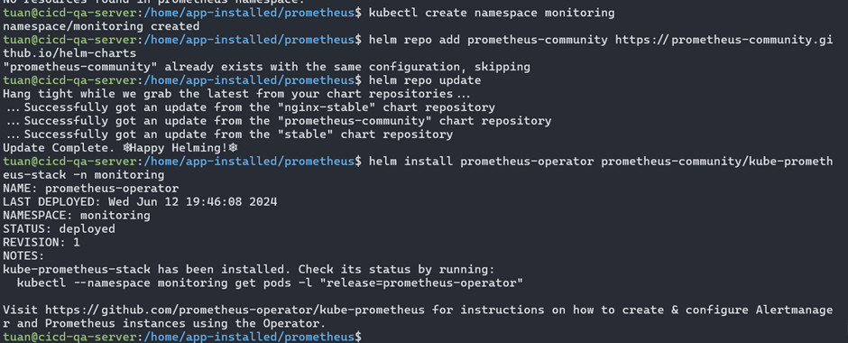
</div>
<br>

Check the Prometheus pods:

<div align="center">
  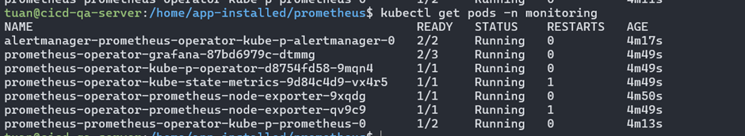
</div>
<br>

Run the following command to expose the `prometheus-operator-kube-p-prometheus` service to NodePort on port `32090`:

`kubectl patch svc prometheus-operator-kube-p-prometheus -n monitoring -p '{"spec": {"type": "NodePort", "ports": [{"port": 9090, "targetPort": 9090, "nodePort": 32090}]}}'`

Access port `32090` to open the Prometheus interface in the browser:

<div align="center">
  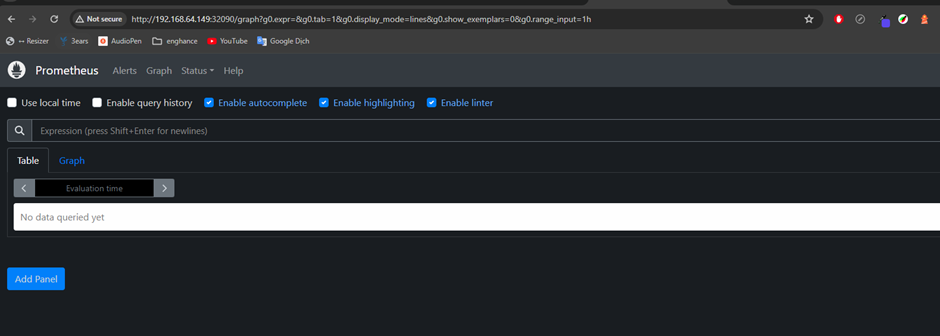
</div>
<br>

### 2.3 Using Prometheus Operator's Service Monitor

Use Prometheus Operator's Service Monitor to monitor Web Deployment and API Deployment.

**Monitor Web Deployment**

Create the `web-service-monitor.yaml` file and apply it to the cluster:

```shell
apiVersion: monitoring.coreos.com/v1
kind: ServiceMonitor
metadata:
  name: vdt-web-sm
  namespace: monitoring
  labels:
    app: vdt-web
    release: prometheus-operator
spec:
  selector:
    matchLabels:
      app: vdt-web
  namespaceSelector:
    matchNames:
      - vdt-final
  endpoints:
  - port: metrics
    path: /metrics
    interval: 15s
```

Describe the web service to see that the web metrics have been exposed by `Nginx prometheus exporter` on port `9100` with the port name `metrics`.

<div align="center">
  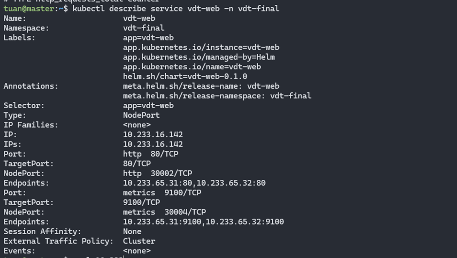
</div>
<br>

Get metrics using `curl`:

<div align="center">
  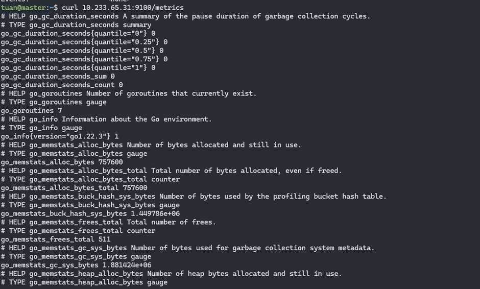
</div>
<br>

Image of the target list of Web Deployment monitored by Prometheus:

<div align="center">
  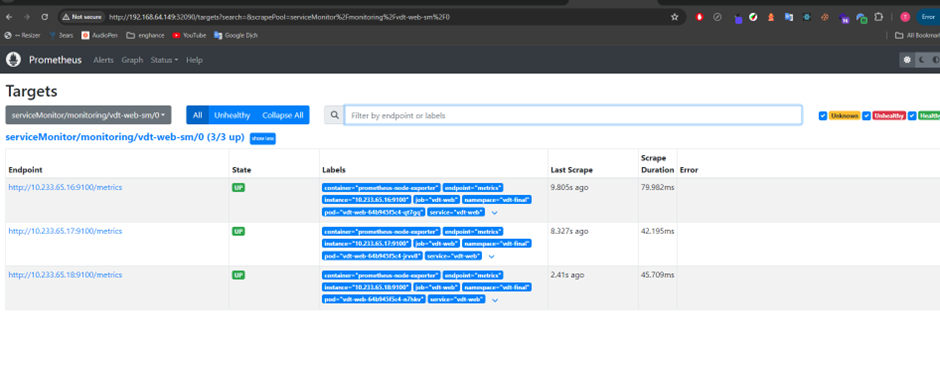
</div>

**Monitor Api Deployment**

Create the `api-service-monitor.yaml` file and apply it to the cluster:

```shell
apiVersion: monitoring.coreos.com/v1
kind: ServiceMonitor
metadata:
  name: vdt-api-sm
  namespace: monitoring
  labels:
    app: vdt-api
    release: prometheus-operator
spec:
  selector:
    matchLabels:
      app: vdt-api
  namespaceSelector:
    matchNames:
      - vdt-final
  endpoints:
  - port: http
    path: /metrics
    interval: 15s
```

For the api metrics, they are exposed via the `metrics` path on port `4000` with the port name `http`.

<div align="center">
  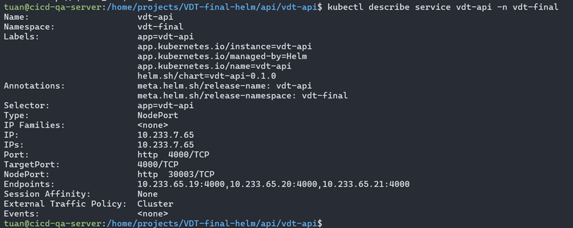
</div>
<br>

Get metrics using `curl`:

<div align="center">
  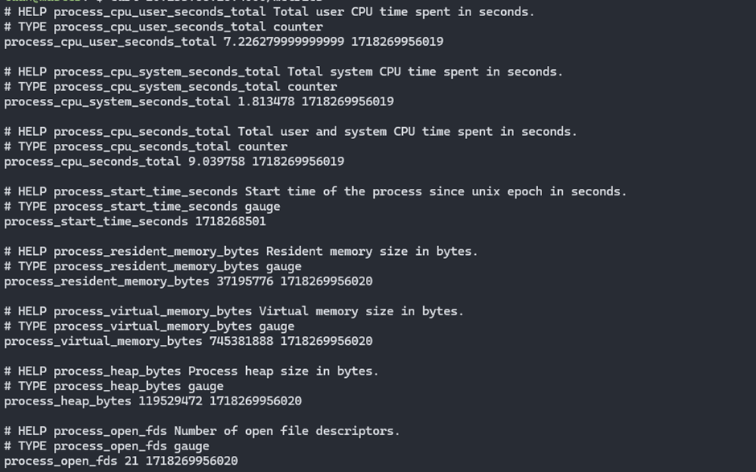
</div>
<br>

Image of the target list of Api Deployment monitored by Prometheus:

<div align="center">
  
</div>
<br>
