# Security

### 1. Setting up HAProxy Loadbalancer

Not completed

### 2. Authentication and Authorization

Authentication is the process of verifying the identity of a user, typically by checking login information such as username and password. One of the modern and popular methods for implementing authentication in web applications and APIs is using JWT (JSON Web Tokens).

JSON Web Token (JWT) is an open standard (RFC 7519) for creating tokens in JSON format to securely transmit information between parties. JWT is widely used for authentication and authorization.

  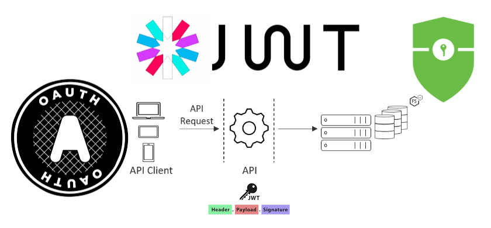

 

A JWT consists of three main parts:

- Header: Contains information about the signing algorithm and token type.
- Payload: Contains claims such as user information, expiration time, access rights, etc.
- Signature: Created by signing the header and payload with a secret key or private key.

A common model with JWT is stateless, storing `access-token` and `refresh-token` on the client side ([Difference between stateful and stateless authentication](https://www.openidentityplatform.org/blog/stateless-vs-stateful-authentication)).

In this lab, `access-token` and `refresh-token` will be returned when a user logs in or registers in the system. The `access-token` will be stored in local storage, while the `refresh-token` will be stored in a cookie. Authorization between `user` and `admin` is done through a `role` field stored in the payload of the JWT (do not store sensitive information in the JWT payload).

When accessing an endpoint, an `accessTokenValidator` middleware will be set up to verify if the token provided in the header is issued by the system. For endpoints requiring `admin` rights, after passing through the `accessTokenValidator` middleware, another middleware called `isAdminValidator` will be used. This middleware will extract the `role` information from the token payload to determine if the role is `user` or `admin`.
For details, see the PR: [VDT-midterm-api/authen-author](https://github.com/quangtuanitmo18/VDT-midterm-api/pull/8)

**Demo images**

The steps below are just a simulation of Authentication and Authorization; in reality, the process will be more complex (e.g., after registration, email verification is required, tokens must be verified before use, RBAC authorization model, etc.)

When a user registers through the `register` endpoint, they will receive a token.

  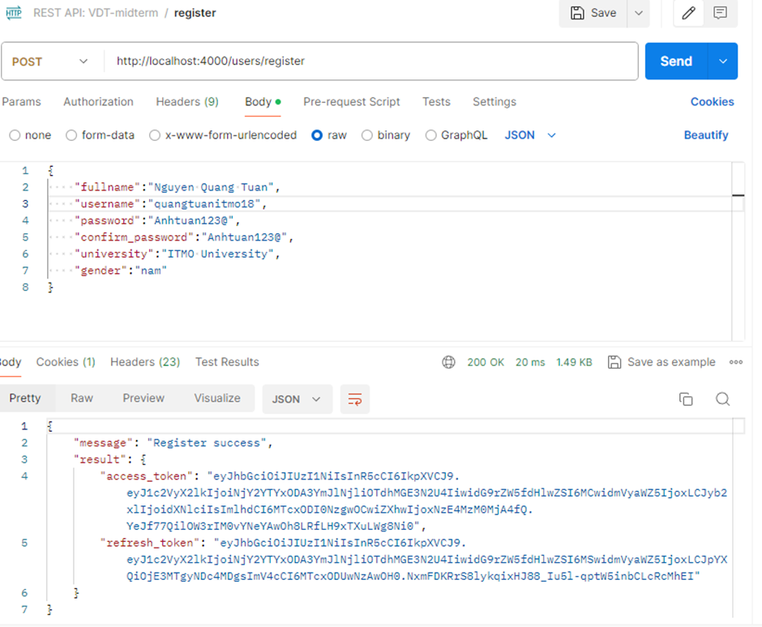

 

Decoding the `access-token` reveals the following payload information:

  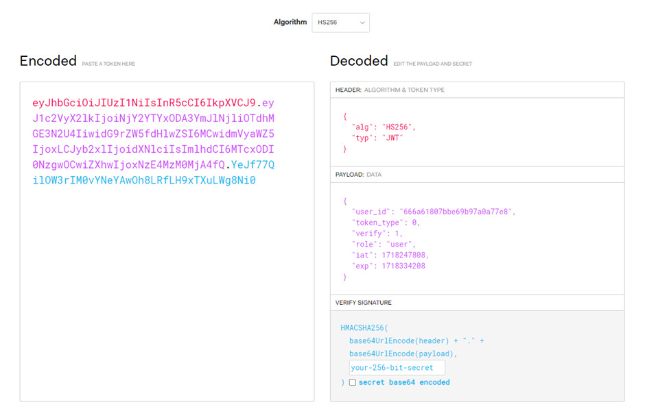

 

When logging in through the `login` endpoint, a token will also be received.

  

 

Add the `accessTokenValidator` and `isAdminValidator` middleware to the `create`, `update`, and `delete` endpoints. Thus, to execute these endpoints, a valid token and `admin` role are required.

  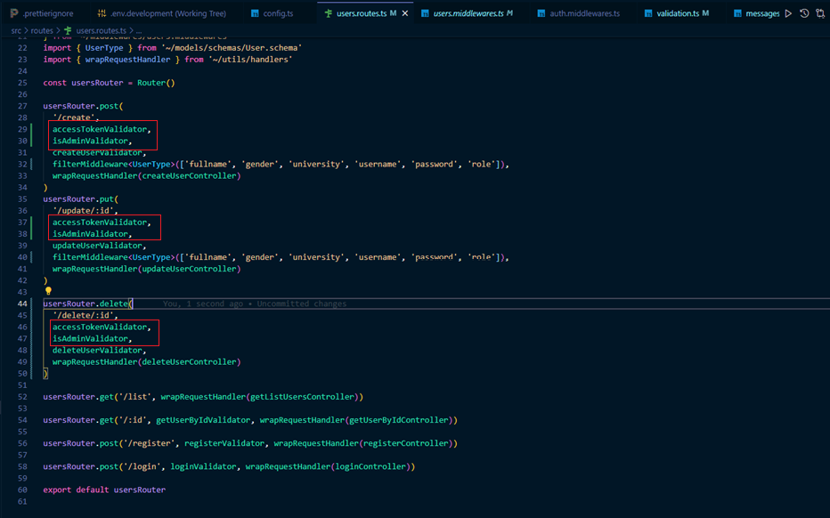

 

Executing the `create` endpoint with a token having the `user` role will return `403`.

  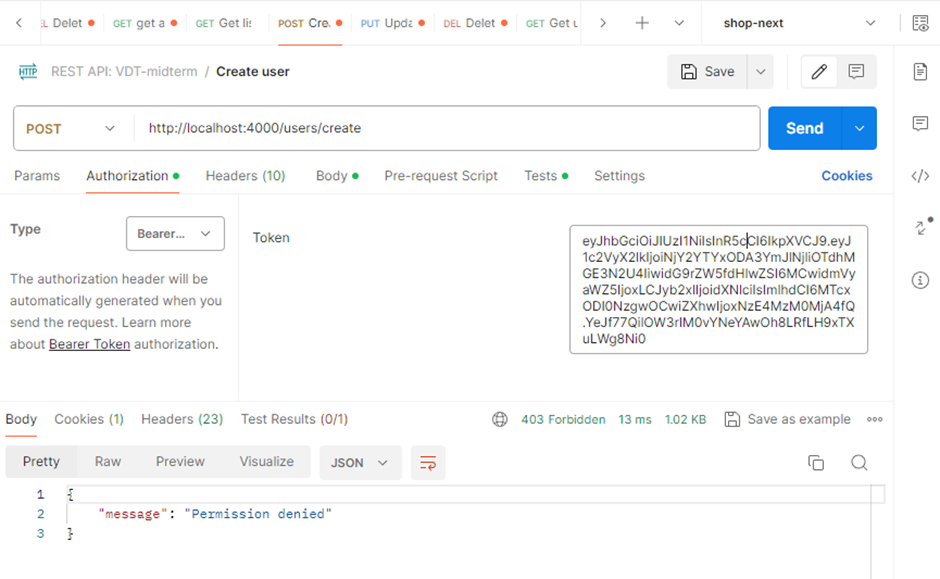

 
Getting the user list will still work normally.

  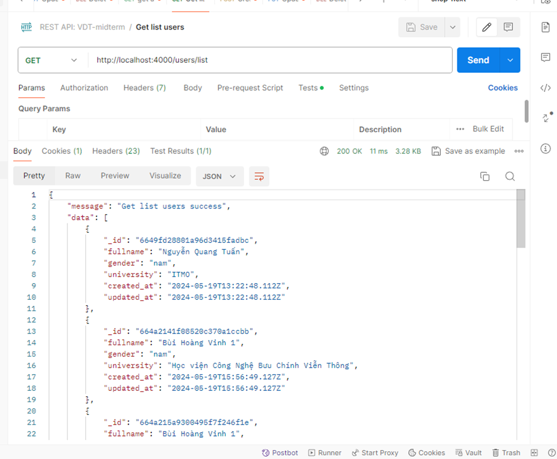

 

Now, log in with a user having the `admin` role, and use that token to execute the `create`, `update`, `delete` endpoints.

  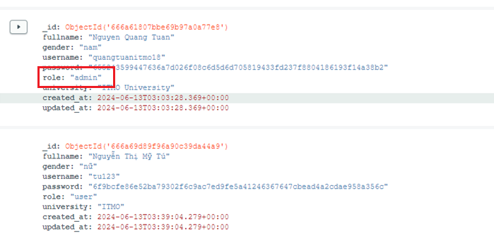

 

  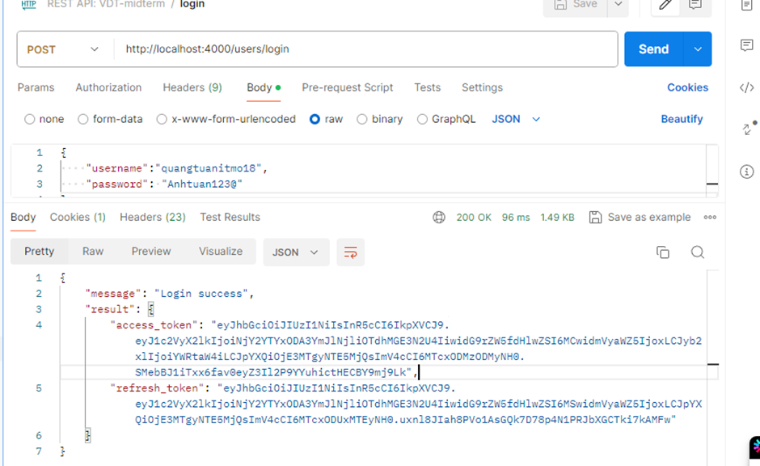

 

  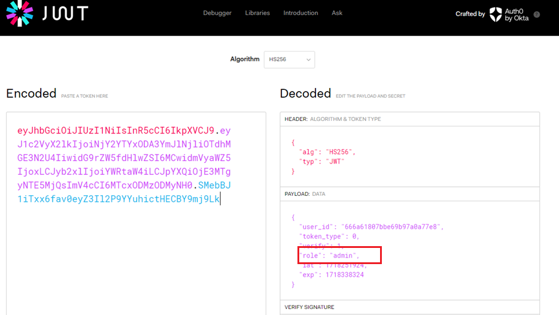

 

Execute the `create`, `update`, `delete` endpoints with the above token.
`create` returns `200`, while `update` and `delete` return status code `204`.

  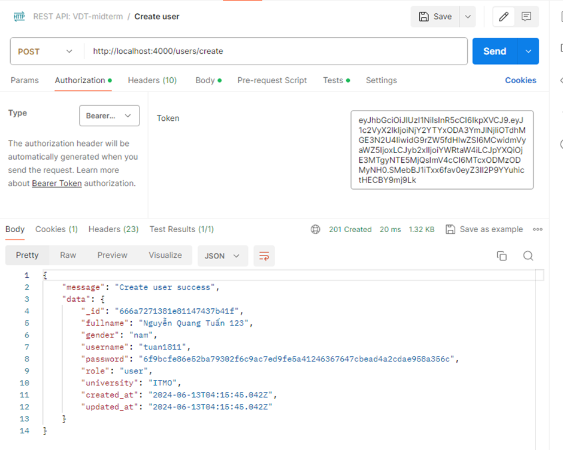

  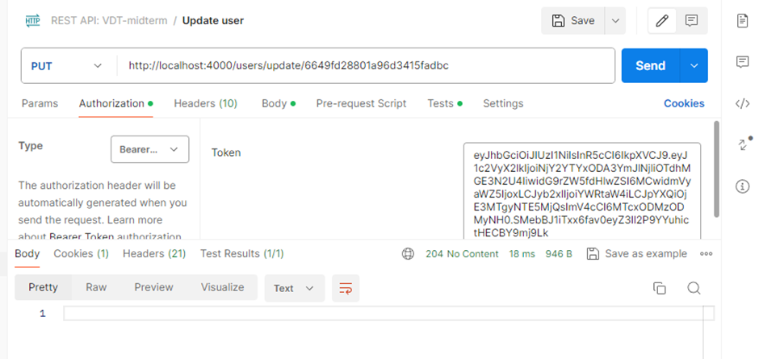

  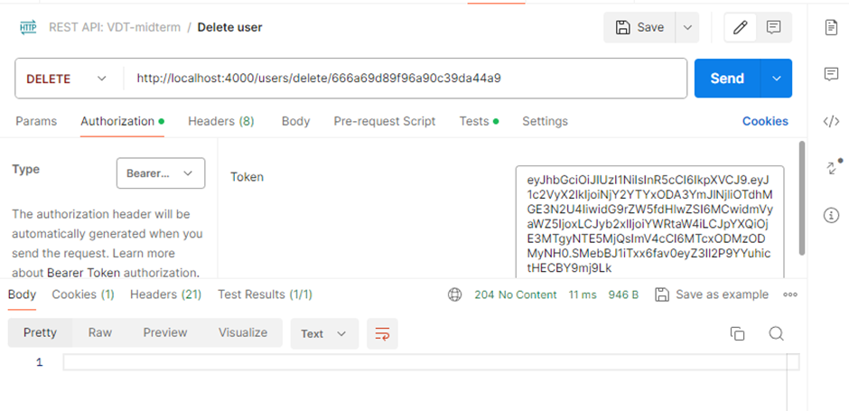

### 3. Rate Limiting for API Service Endpoints

Rate Limiting is a technique used to control the number of requests a user or application can send to a service within a certain period. This helps prevent resource overuse or DDoS attacks.

`express-rate-limit` is a popular package for Node.js and Express, allowing easy implementation of rate limiting.

  

  <i><a href=https://singh-sandeep.medium.com/protecting-your-node-js-application-with-express-rate-limiter-a-guide-to-rate-limiting-in-node-js-5763e4e22d18/>
         Express Rate Limiter
</a></i>

 

For detailed implementation of `express-rate-limit`, see the PR [VDT-midterm-api/rate-limiting](https://github.com/quangtuanitmo18/VDT-midterm-api/pull/10)

The configuration of `express-rate-limit` is as follows:

- `windowMs`: The time window in milliseconds for which the limit is applied.
- `max`: The maximum number of requests an IP can send within each window.
- `standardHeaders`: When set to true, rate limit information will be returned in standard headers like `RateLimit-Limit`, `RateLimit-Remaining`, and `RateLimit-Reset`.
- `legacyHeaders`: When set to false, old headers like `X-RateLimit-Limit`, `X-RateLimit-Remaining`, and `X-RateLimit-Reset` will be disabled.
- `statusCode`: Here, it returns status code `429`, meaning `TooManyRequests`.

  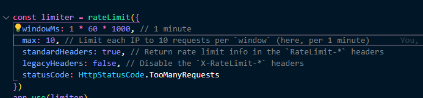

 

Access the browser and make more than 10 requests within 1 minute to receive `429 Too Many Requests`.

  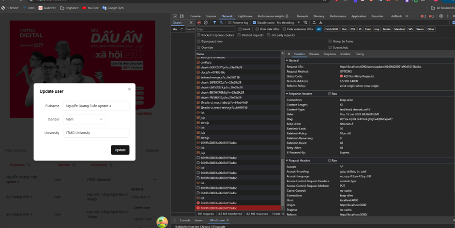

 
