# Develop a simple 3-tier web application

## 1. Description

3-tier web application using 3 services: web, api, and database based on the MERN (MongoDB, ExpressJs, ReactJs, NodeJs) Stack.

  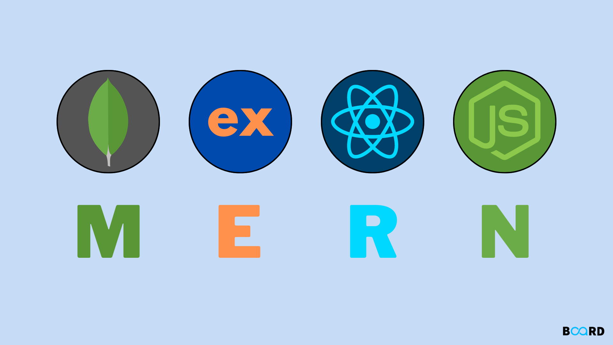

  <i><a href=https://www.boardinfinity.com/blog/mern-stack-what-is-it>
         MERN Stack
        </a></i>

 

Maintain the source code of api and web in 2 different repositories, each feature is a pull request. In both repositories, apply git flow to create main, release, and develop branches. When developing a new feature, checkout and create a pull request to the develop branch. From develop, it will be merged into release and then to main. Tags will be created from the main branch to mark deployment versions.

  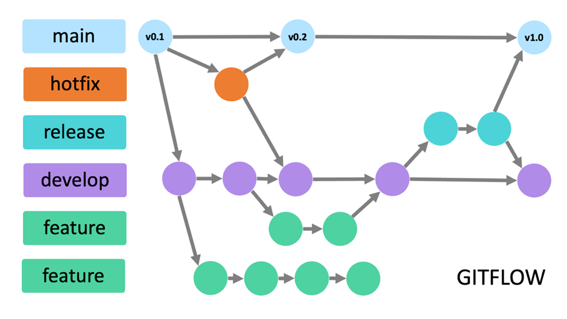

  <i><a href=https://medium.com/@yanminthwin/understanding-github-flow-and-git-flow-957bc6e12220>
         Understanding GitHub Flow and Git Flow
        </a></i>

 

Commits sent up will follow a convention. Commit convention is a standardized way of writing commit messages during software development. It helps team members better understand the content of each commit and easily track the project's change history. In the 2 repositories `VDT-midterm-api` and `VDT-midterm-web`, Angular Conventional Commit will be used.

  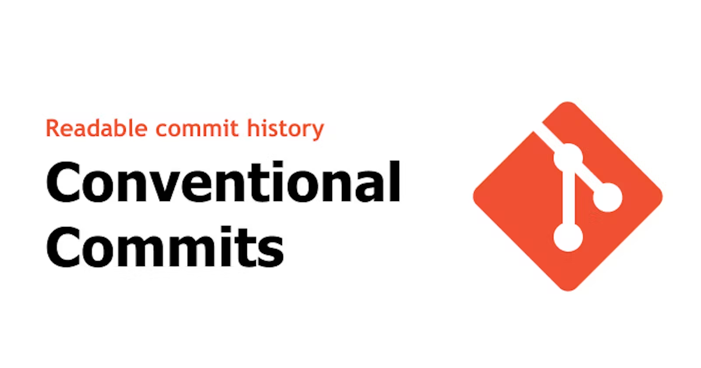

  <i><a href=https://www.conventionalcommits.org/en/v1.0.0-beta.4>
         Angular Conventional Commit
        </a></i>

 

### 1.1 Web service

Develop the web service using the [ReactJS](https://react.dev/) library written in [TypeScript](https://www.typescriptlang.org/) and combined with a build tool with module bundler Rollup, which is [ViteJs](https://vitejs.dev/).

ReactJS is a popular JavaScript library for building user interfaces. Vite is a fast and modern build tool that speeds up development by providing a fast development environment and an efficient build system. TypeScript is an extension of JavaScript that provides static type checking and powerful development tools. Combining ReactJS, Vite, and TypeScript helps improve development performance and code quality.

  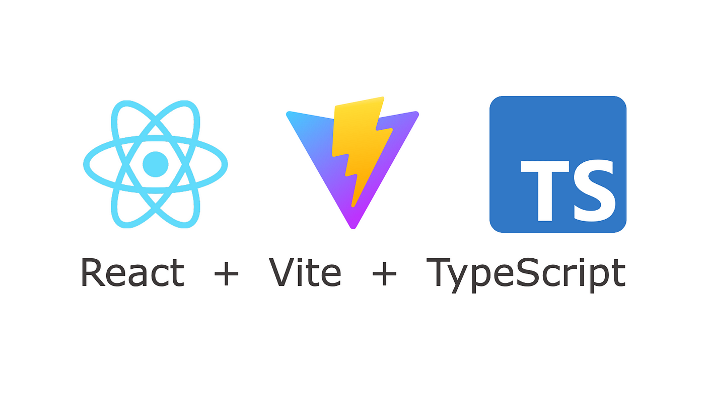

  <i> ReactJs + Vite + TypeScript</i>

### 1.2 Api service

Develop the api service using the [ExpressJs](https://expressjs.com/) framework of Nodejs written in TypeScript.

Express.js is a popular web framework for Node.js, allowing for quick and easy creation of web applications and APIs. TypeScript is an extension of JavaScript that provides static type checking and powerful development tools. Using TypeScript with Express.js helps improve code quality and project maintainability.

  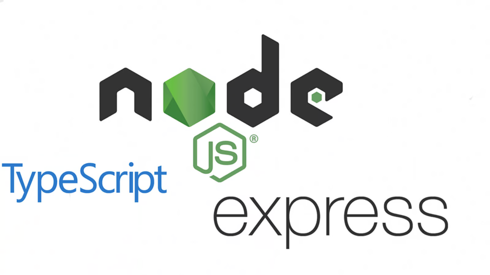

  <i>Nodejs + ExpressJs + TypeScript</i>

### 1.3 Database service

Develop the database service based on the MongoDB database.

MongoDB is an open-source NoSQL database that allows for flexible JSON document storage and querying. Designed for scalability and flexibility in storing unstructured data, MongoDB is a popular choice for fast and modern web applications.

  

  <i>MongoDB</i>

## 2. Output

- <b>Api repository</b>: [VDT-midterm-api](https://github.com/quangtuanitmo18/VDT-midterm-api)

  - Pull requests:
    - [Feature/api-crud-users](https://github.com/quangtuanitmo18/VDT-midterm-api/pull/1)
    - [Feature/dockerize-api-server](https://github.com/quangtuanitmo18/VDT-midterm-api/pull/2)
    - [Feature/test-api-crud-users](https://github.com/quangtuanitmo18/VDT-midterm-api/pull/3)
    - [Feature/pipeline-ci-cd](https://github.com/quangtuanitmo18/VDT-midterm-api/pull/4)

- <b>Web repository</b>: [VDT-midterm-web](https://github.com/quangtuanitmo18/VDT-midterm-web)
  - Pull requests:
    - [Feature/users-data-binding](https://github.com/quangtuanitmo18/VDT-midterm-web/pull/1)
    - [Feature/dockerize-client-server](https://github.com/quangtuanitmo18/VDT-midterm-web/pull/2)
    - [Feature/pipeline-ci-cd](https://github.com/quangtuanitmo18/VDT-midterm-web/pull/3)

 

#### Test Api on postman

  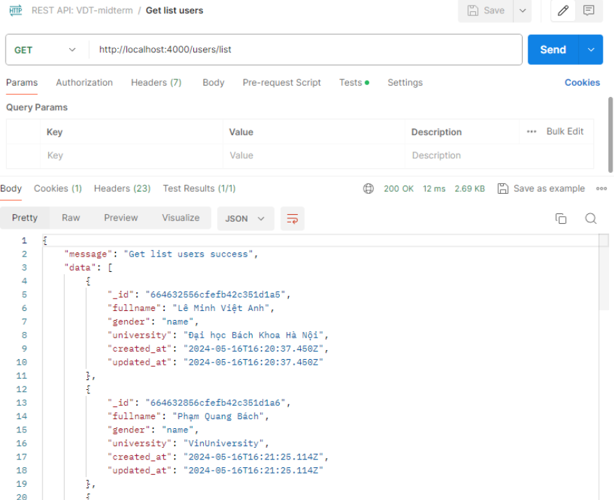

  <i>Api get list users</i>

 

  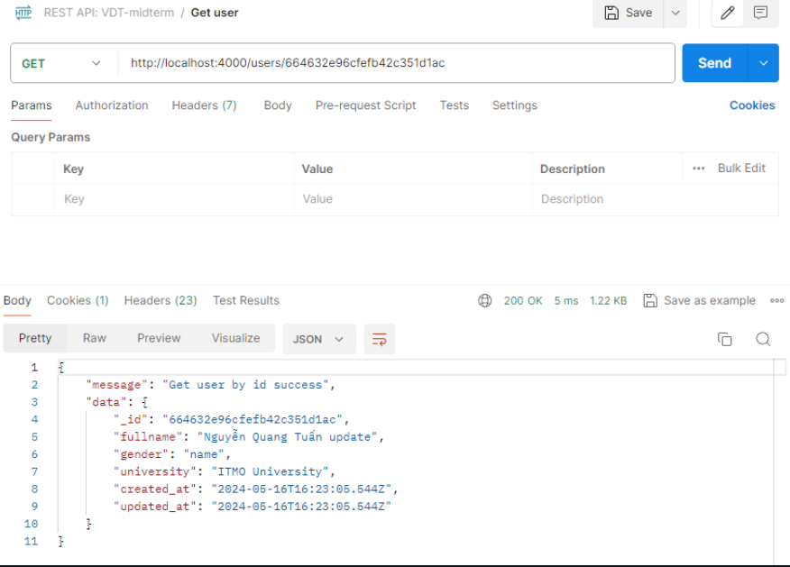

  <i>Api get user</i>

 

  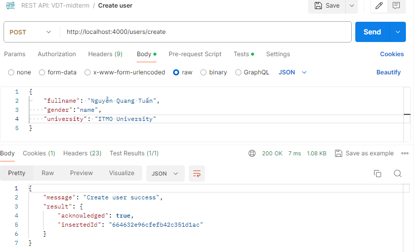

  <i>Api create user</i>

 

  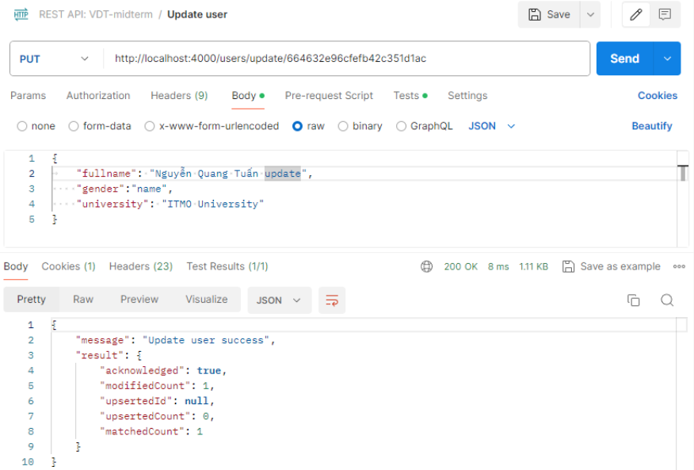

  <i>Api update user</i>

 

  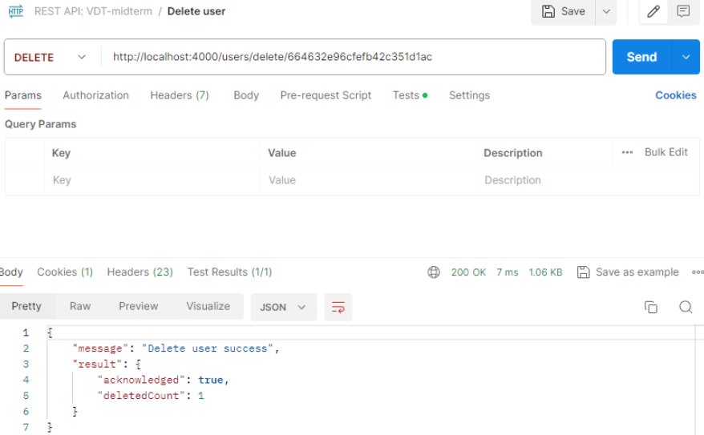

  <i>Api delete user</i>

 

#### Results when running test cases

  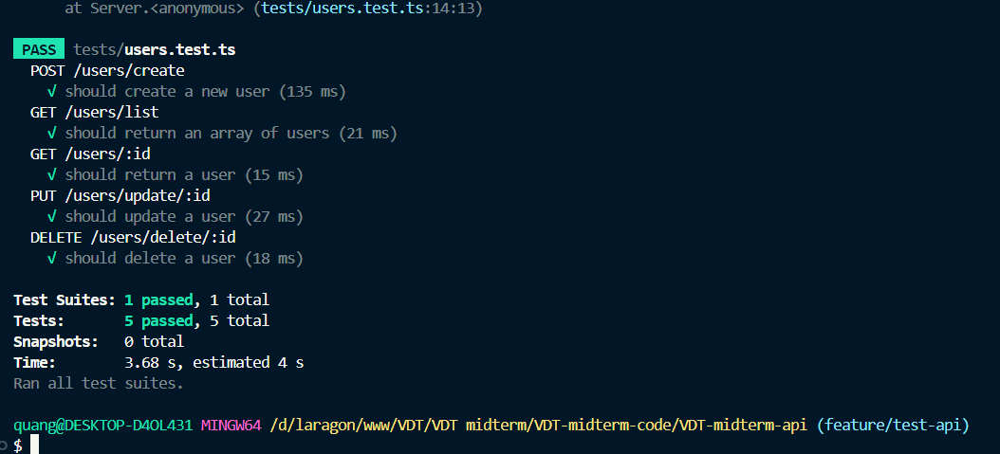

  <i>Result of test cases</i>

 

#### Results displayed on the browser

  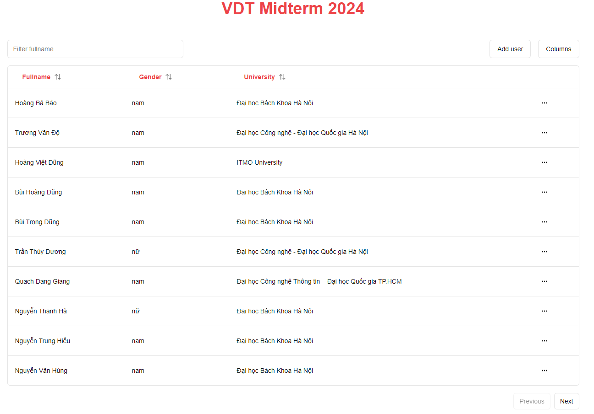

  <i>User list table</i>

 
