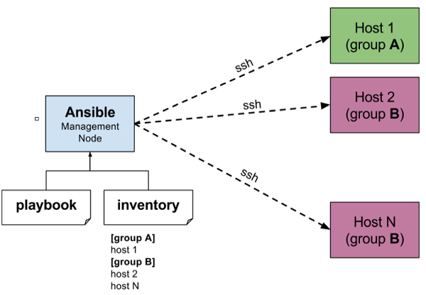
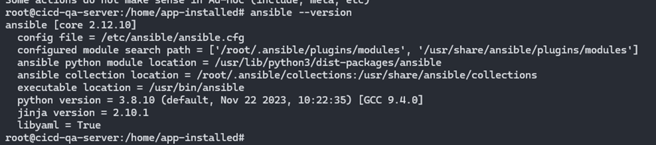
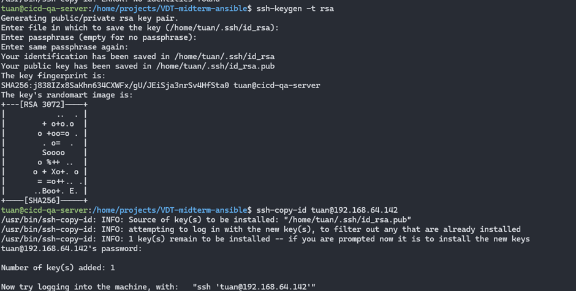
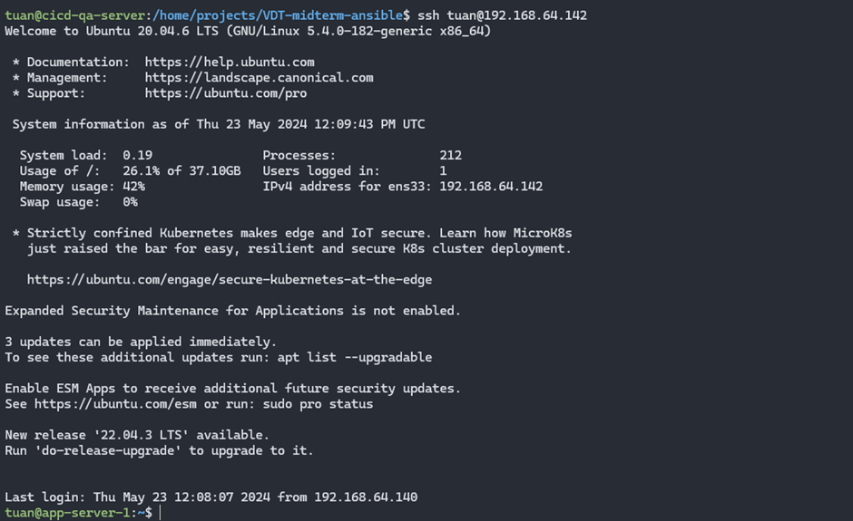

## Install Ansible on the server (cicd-qa-server: 192.168.64.140)

Ansible is an open-source tool used to automate system administration tasks and application deployment. It allows writing playbooks to define specific tasks and deploy them on target servers easily and efficiently.

The main components of Ansible include:

- Inventory: A list of servers to manage and deploy. Ansible uses inventory to know which servers are active and perform tasks on them.

- Playbooks: YAML scripts written to define specific jobs to be performed on target servers. Each playbook includes one or more tasks, and each task can be a role, a task, or a handler.

- Roles: A way to organize and share code between playbooks. A role is a collection of tasks and specific template files for a particular function or application. Roles help reuse code, minimize repetition, and make management easier.

- Tasks: Specific jobs performed on target servers. Each task defines an action such as installing software packages, starting services, copying files, etc.

- Handlers: Jobs triggered only when needed, often used to restart services after changes have been applied.

- Modules: Small programs executed on target servers to perform specific jobs. Ansible comes with many built-in modules such as copy, yum, apt, service, command, etc.

- Vars: Ansible allows defining variables to use in playbooks (simply configuring variables to reuse configurations, pass variables, secure data, etc.)

  

#### Install Ansible

[ansible-setup.sh](../scripts/ansible-setup.sh)

`touch ansible-setup.sh && chmod +x ansible-setup.sh && vim docker-setup.sh`

`./ansible-setup.sh` run the script to install ansible and check the version as shown below

  

 

After installing Ansible, the next step is to create an ssh key and copy the public key to the servers.

Below is the process to create an ssh key and copy it to the server `app-server-1: 192.168.64.142`, for other servers, do the same.

Create an ssh key from user `tuan` using the command `ssh-keygen -t rsa`, then copy it to `app-server-1: 192.168.64.142` using the command `ssh-copy-id tuan@192.168.64.142`

The first `tuan` user is the user on the ansible host `cicd-qa-server: 192.168.64.140`, the second `tuan` user is the user on the target host `app-server-1: 192.168.64.142`

To allow the `tuan` user on the ansible host to have sudo privileges without entering a password during execution, add the config `tuan ALL=(ALL) NOPASSWD:ALL` to `/etc/sudoers.tmp`. For the user on the target host, do the same to have sufficient permissions to install software packages, start services, copy files, etc.

  

 

After copying the public key to the target host, ssh to it without using a password

  

