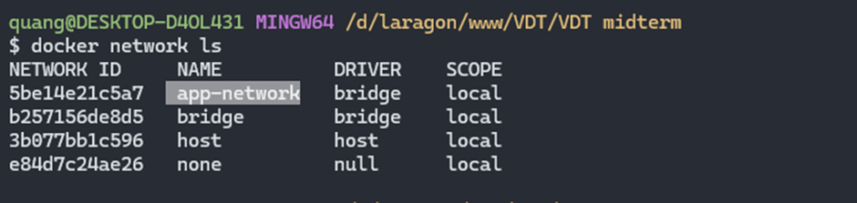
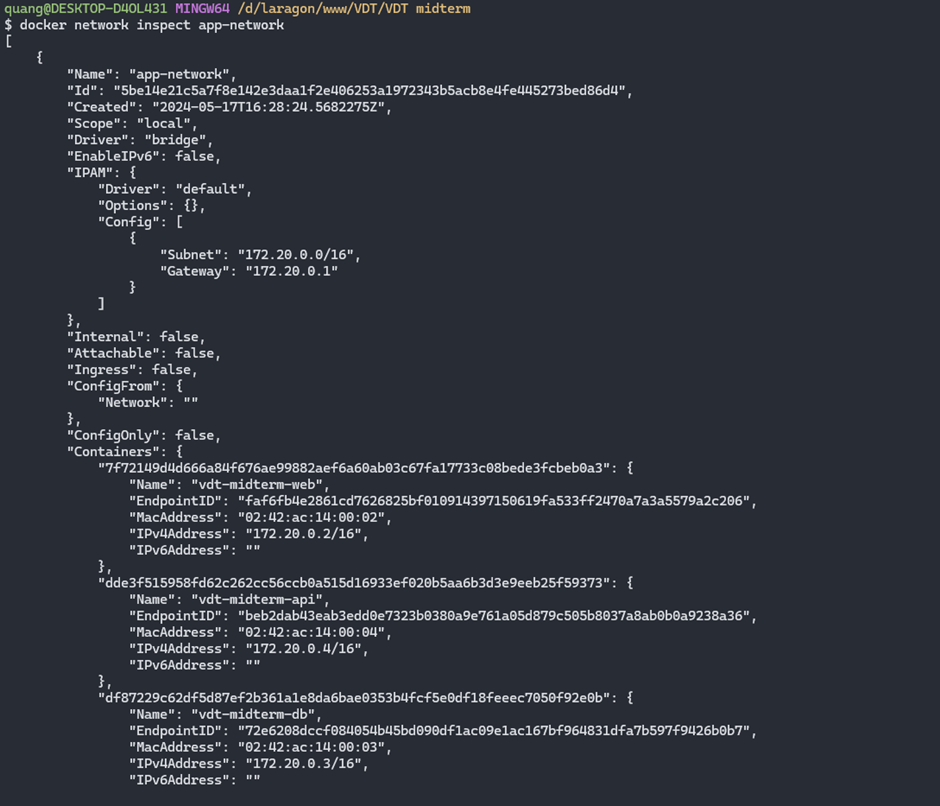

## Setup network to connect api, web, and db services

Run the command `docker network create app-network` to create a network named **app-network**.

Check existing networks with `docker network ls`.

  

  <i>Container networking</i>

After running 3 containers for the 3 services web, api, and db, inspect the network to see that the 3 services are in **app-network**.

  

  <i>Inspect network</i>

