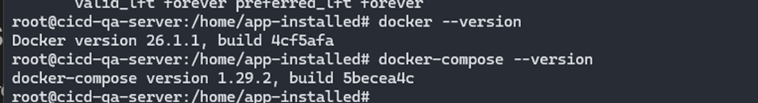

## Install docker and docker-compose on the servers

File [docker-setup.sh](../scripts/docker-setup.sh) for installing docker and docker-compose.

`touch docker-setup.sh && chmod +x docker-setup.sh && vim docker-setup.sh`

`./docker-setup.sh` run the script to install docker and check the version as shown below

  

 

The above is the installation of docker and docker-compose on `cicd-qa-server: 192.168.64.140`, for other servers, do the same.

**_After installing Ansible, you can use Ansible to install docker and docker-compose on target hosts more quickly and conveniently._**
