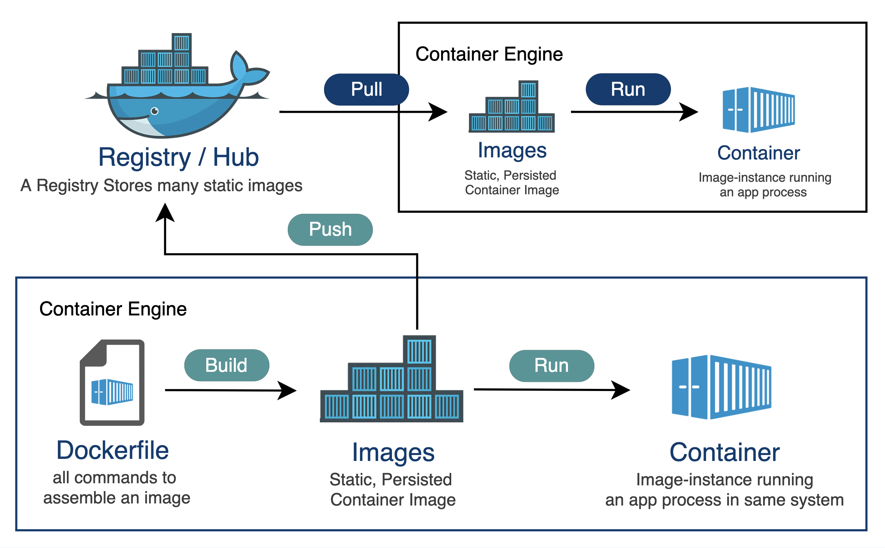
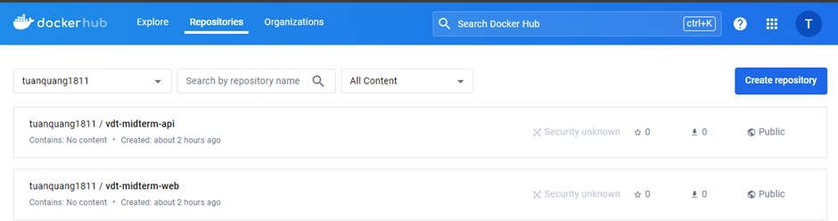

## Create a repository on Docker Hub

Docker Hub is a service for storing and sharing Docker containers provided by Docker Inc. It is an essential part of the Docker ecosystem, helping developers and organizations easily find, store, manage, and share Docker images. Below are some details about Docker Hub:

- Main functions

  - Store Docker images: Docker Hub is where Docker images are stored, including official images released by Docker and its partners, as well as community-created images.
  - Share images: Users can share Docker images with the community or within their development team. Docker Hub supports setting up public and private repositories.
  - Search and download images: Users can search and download available Docker images from Docker Hub, making it easy to deploy applications and services.
  - CI/CD integration: Docker Hub integrates with popular CI/CD systems like Jenkins, GitLab CI, Travis CI, helping automate the process of building and pushing Docker images.

- Main components

  - Repositories: This is where Docker images are stored. There are two main types of repositories:

    - Public repositories: Anyone can access and download images in public repositories.
    - Private repositories: Only designated users have access, suitable for storing internal or secure images.

  - Organizations: Docker Hub allows creating and managing organizations, making it easy to manage access and share Docker images within a development team or company.
  - Teams: Within each organization, users can create teams and assign different access permissions to each team.

  

<i><a href=https://community.sap.com/t5/technology-blogs-by-sap/use-private-registry-for-containerize-a-cap-application-part-1/ba-p/13541667>
Docker Hub
</a></i>

 

With a free personal account, you can only create 1 private repository on Docker Hub.

Create 2 public repositories on Docker Hub: `vdt-midterm-api` and `vdt-midterm-web`

  

 
