## Setup Jenkins server (cicd-qa-server: 192.168.64.140) on port 8080

Jenkins is an open-source tool written in Java used to automate tasks related to software development, especially in CI/CD. Jenkins can integrate with most other tools in the continuous integration system across various platforms. Additionally, the Jenkins community is large, making it easy to use and get support when needed.

<div align="center">
  
</div>

<div align="center">
  <i>jenkins</i>
</div>
<br>

### Install Jenkins

[jenkins-setup.sh](../scripts/jenkins-setup.sh)

`touch jenkins-setup.sh && chmod +x jenkins-setup.sh && vim jenkins-setup.sh` create a directory to store the configuration for installing applications, navigate to that directory, create a script file to install Jenkins, and grant execution permissions to that file.

Run the command `./jenkins-setup.sh` to install Jenkins. The default port for Jenkins is 8080.

<div align="center">
  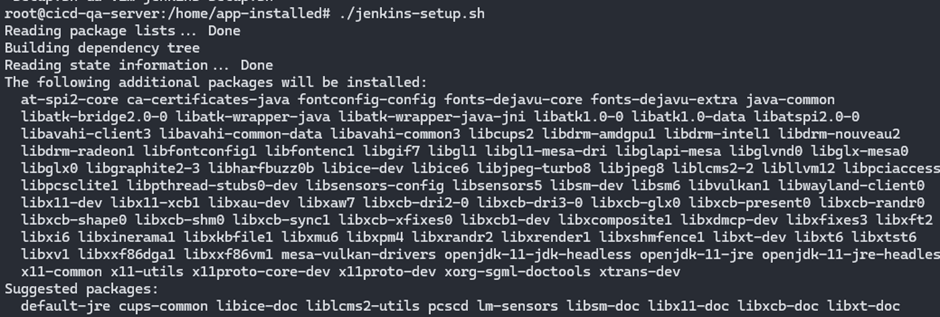
</div>

After successfully installing Jenkins, open a browser and access the link `192.168.64.140:8080`

<div align="center">
  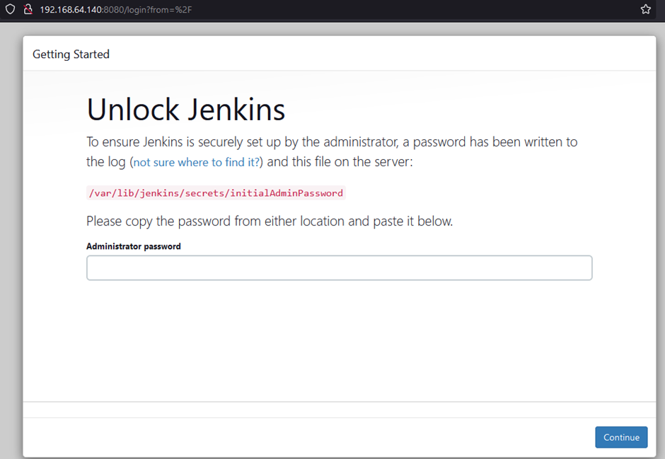
</div>

To get the root user's password on Jenkins, run the command `cat /var/lib/jenkins/secrets/initialAdminPassword`

<div align="center">
  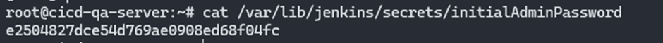
</div>

Next, install the default plugins on Jenkins.

<div align="center">
  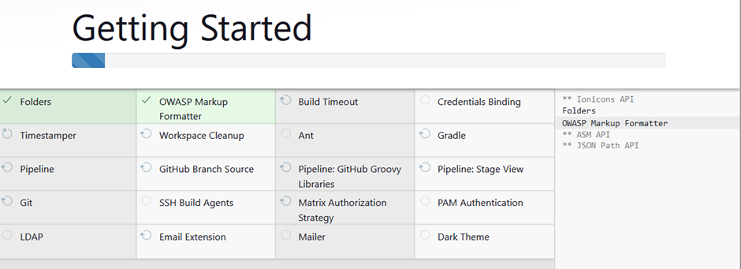
</div>

Then create an account and set up the Jenkins URL.

<div align="center">
  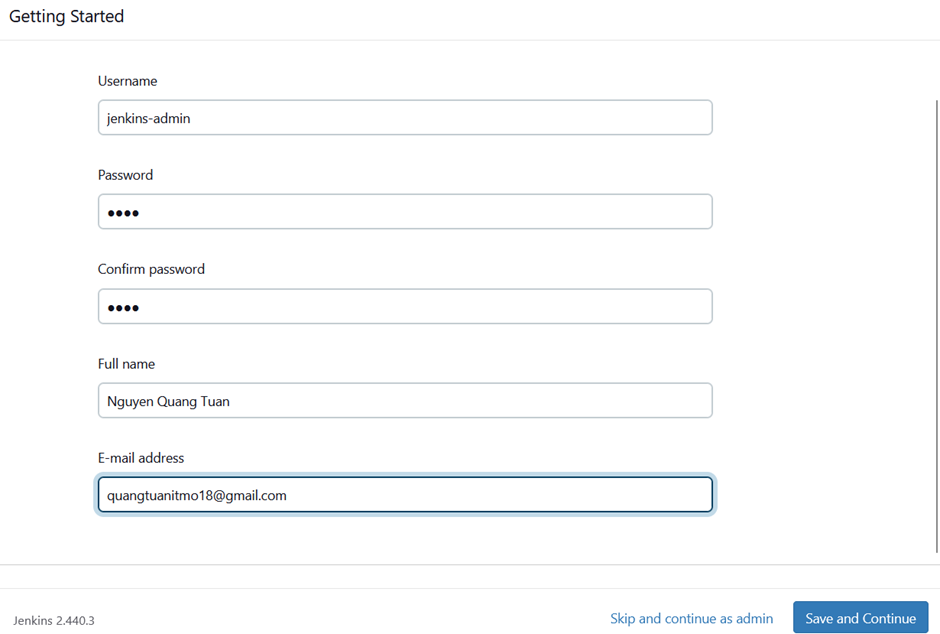
</div>

<div align="center">
  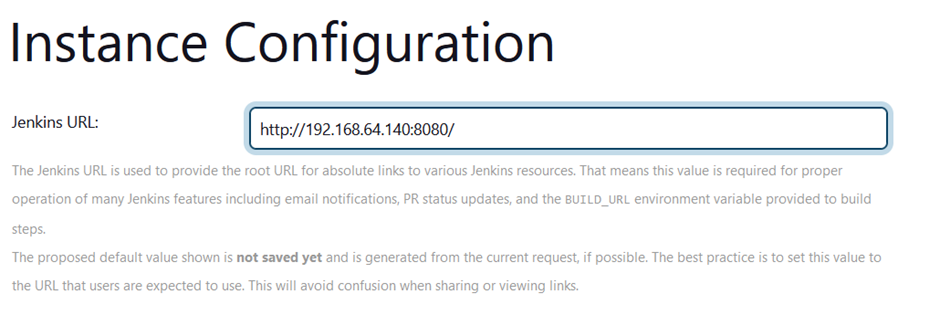
</div>

After completing the above steps, you will successfully install and access the Jenkins management screen.

<div align="center">
  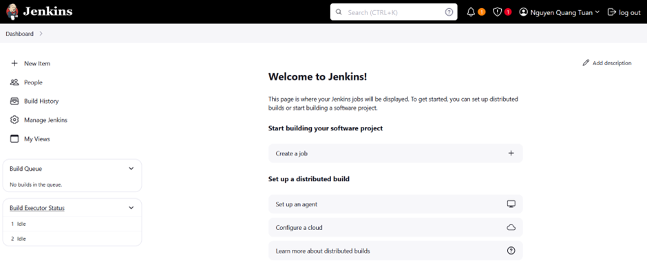
</div>
<br>

Next, similarly install docker and docker-compose for the Jenkins server ([docker-setup.sh](../scripts/docker-setup.sh))

`touch docker-setup.sh && chmod +x docker-setup.sh && vim docker-setup.sh`

`./docker-setup.sh` run the script to install docker and check the version as shown below

<div align="center">
  
</div>
<br>

`usermod -aG docker jenkins` add the Jenkins user to the docker group so Jenkins can use docker in the Jenkins CICD Pipeline.

Install the following plugins on the Jenkins server:

- Gitlab
- Docker
- Blue Ocean
- SSH Agent
- Sonarqube scanner

<div align="center">
  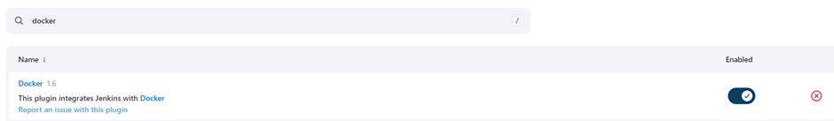
</div>

<div align="center">
  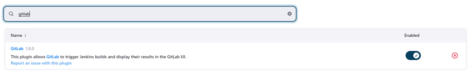
</div>
<div align="center">
  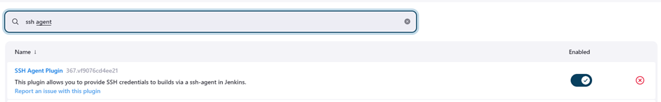
</div>
<div align="center">
  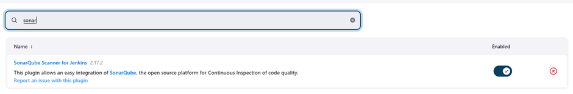
</div>
<div align="center">
  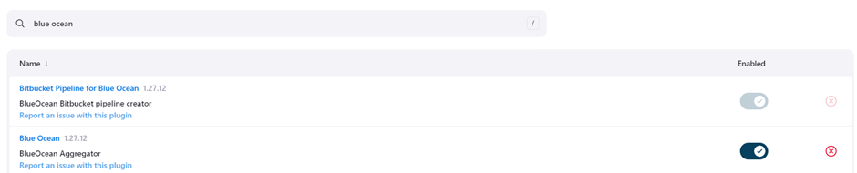
</div>

#### Integrate Gitlab with Jenkins server

In the Jenkins interface, select `Manage Jenkins -> System`, find Gitlab, and configure as shown below.

<div align="center">
  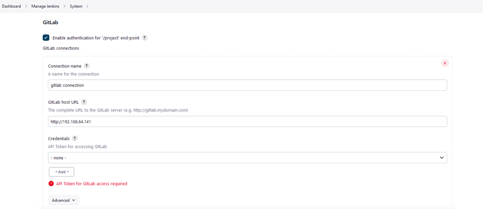
</div>

When selecting add credentials above, a popup will open to create a Credential as shown below. Enter the token information, which is the access token created on the Gitlab server.

<div align="center">
  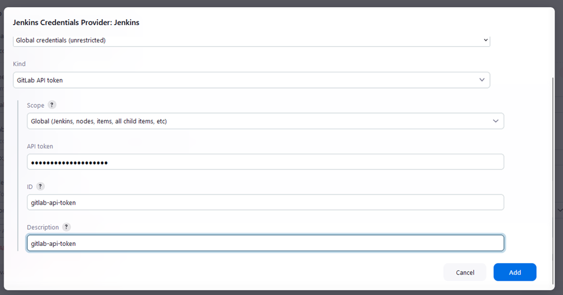
</div>

Go back, select the newly created credentials, click test connect, and it will be successful.

<div align="center">
  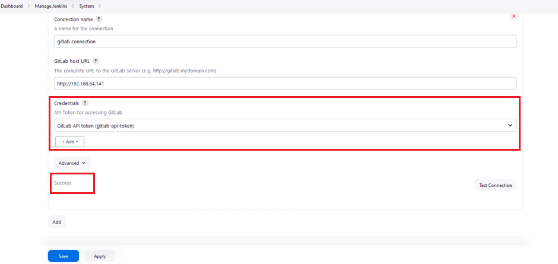
</div>
<br>

#### Integrate Sonarqube with Jenkins server

Similar to integrating Gitlab into Jenkins, you first need a token from Sonarqube.
After obtaining the Sonarqube token, create a credential on Jenkins.
To add a new credential to Jenkins, select `Dashboard -> Manage Jenkins -> Credentials -> System -> Global Credential`.

<div align="center">
  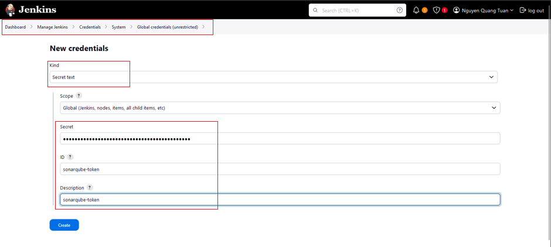
</div>
<br>

Configure the Sonarqube system as shown below (for the server auth token, select the newly created credentials above).

<div align="center">
  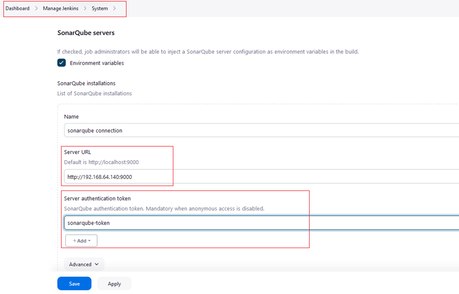
</div>
<br>

#### Integrate Telegram with Jenkins server

After completing the bot setup steps on Telegram, you will receive a `Token` and `chatId`.

Create a credential on Jenkins for the `Token` and `chatId`.
To add a new credential to Jenkins, select `Dashboard -> Manage Jenkins -> Credentials -> System -> Global Credential`.

`secret` is the `Token` and `chatId` received from Telegram.

<div align="center">
  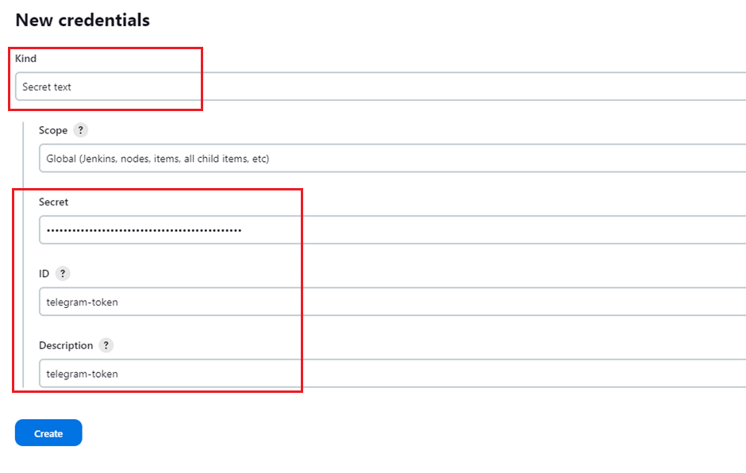
</div>

<div align="center">
  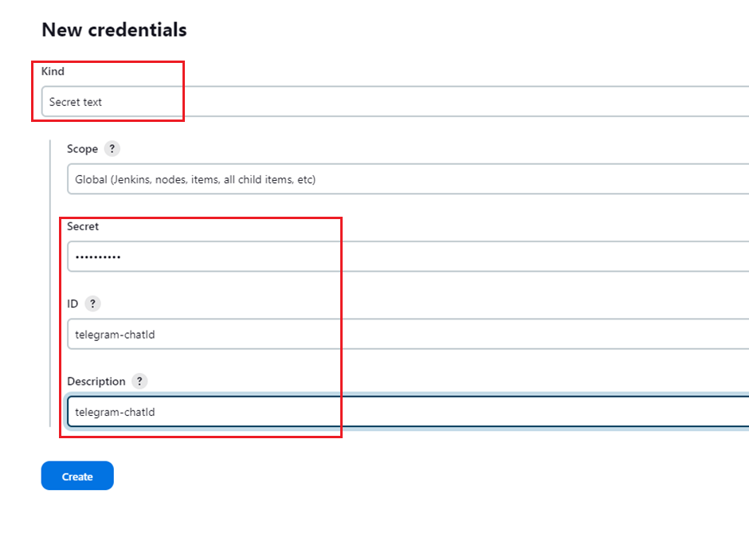
</div>

Configure the TelegramBot system as shown below (Telegram Bot name: is the `username` of the bot created on Telegram and `Telegram Bot token` is the `Token` above).

<div align="center">
  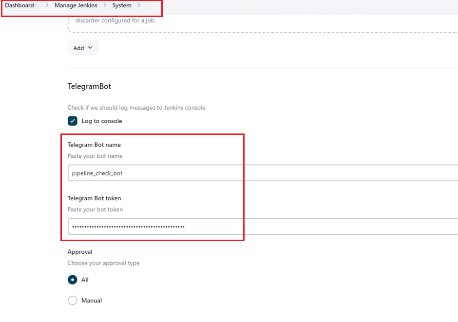
</div>

#### Create a pipeline on Jenkins

There will be 2 pipelines: `pipeline-vdt-midterm-api` and `pipeline-vdt-midterm-web`.
The steps below are performed on `pipeline-vdt-midterm-api`, for `pipeline-vdt-midterm-web` do the same.

Select `New Item` on the Jenkins dashboard to create a pipeline.

<div align="center">
  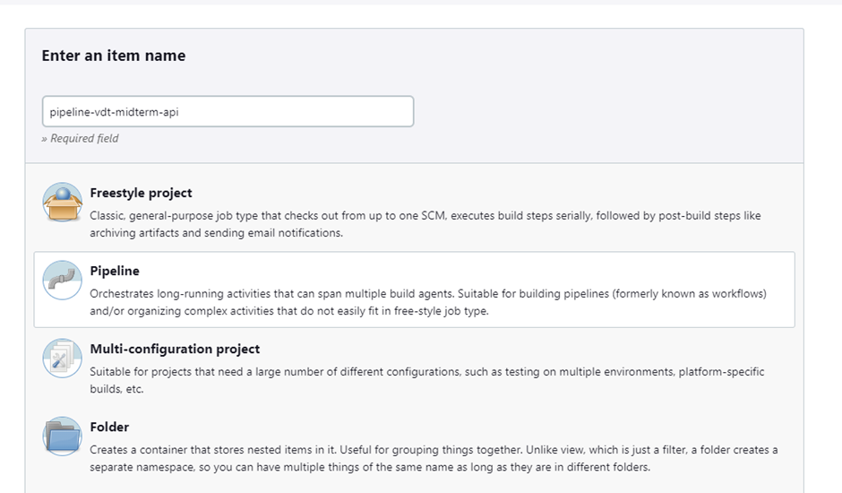
</div>
<br>

In the General section, check `Discard old builds` and keep the last 10 builds.

<div align="center">
  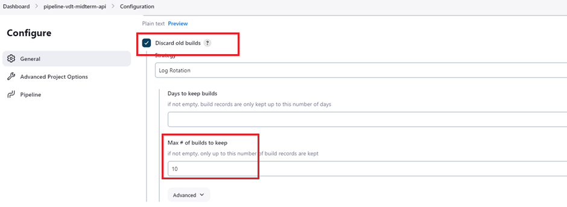
</div>
<br>

Continue in General, build triggers as shown below to allow the Jenkins CICD Pipeline to run actions such as push, merge code.

<div align="center">
  
</div>
<br>

In the pipeline section, select as follows, and the URL is the URL of the project on Gitlab.

<div align="center">
  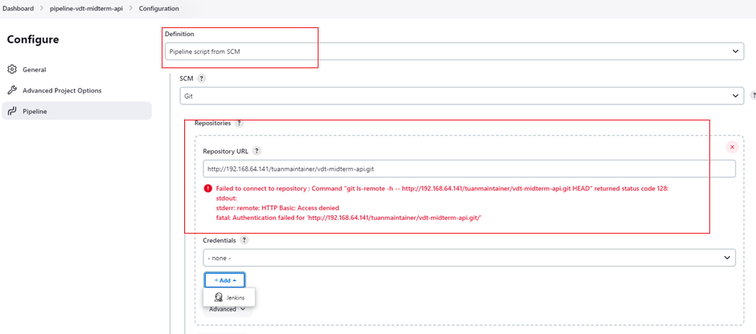
</div>
<br>

Continue to add Gitlab credentials. These credentials are for an account with admin rights on Gitlab, otherwise, the Jenkins CICD Pipeline will not be able to clone the code.

<div align="center">
  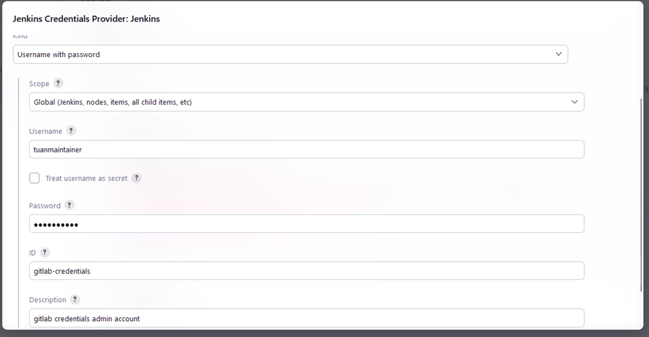
</div>
<br>

In the Pipeline section, select the main and release branches so that Jenkins only runs when there are merge requests or pushes from these branches. This prevents the pipeline from running for any push or merge request on any branch.

<div align="center">
  
</div>
<br>

#### Create an admin user token on Jenkins

The final step to integrate Gitlab with Jenkins is to set up a webhook. To create a webhook on Gitlab, you need the API token of the admin user on Jenkins.

`Dashboard -> user -> configure` to set up the API token on Jenkins.

<div align="center">
  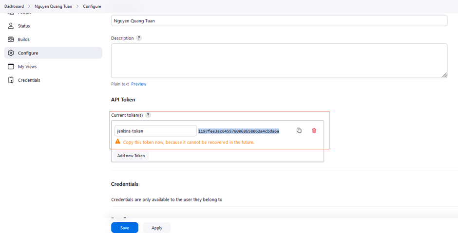
</div>
<br>

#### Create a project management directory

Run the command `mkdir /home/projects/VDT-midterm-api` and `mkdir /home/projects/VDT-midterm-web` to create 2 directories to store the projects.

<div align="center">
  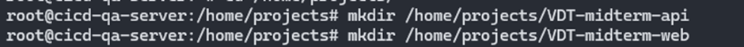
</div>
<br>

Next, in the pipeline, use the `jenkins` user (the default user created when installing the Jenkins server). Some commands executed with the `jenkins` user require sudo privileges and ask for a password, so you need to add the `jenkins` user to the sudo group and allow it to run commands without a password.

Run `visudo` and add `jenkins ALL=(ALL:ALL) NOPASSWD: ALL` under `#Allow members of group sudo to execute any command`.

<div align="center">
  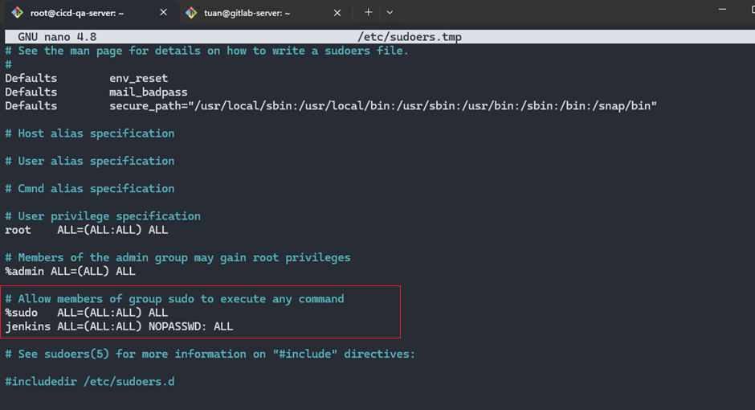
</div>
<br>

**_Example:_**
The code on Gitlab, after being pulled by Jenkins, will be in its workspace.

<div align="center">
  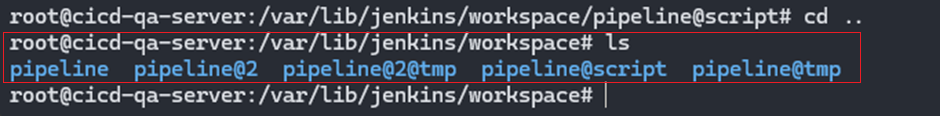
</div>
<br>

You need to copy the code from the Jenkins workspace to the project management directory created above (`VDT-midterm-api` and `VDT-midterm-web`) and grant ownership and execution permissions on that directory to the Jenkins user. In the pipeline, there is a stage called `checkout source` to help do this.

```shell
stage('Checkout source' ){
        steps{
            sh "sudo cp -r . $PATH_PROJECT \
            && sudo chown -R jenkins:jenkins $PATH_PROJECT \
            && sudo chmod -R 755  $PATH_PROJECT \
            "
        }
}
```

With the above stage, since there are commands using `sudo` and currently in the pipeline, the `jenkins` user is used, you need to add the `jenkins` user to the `sudo` group as above and allow it to run commands without a password to prevent the pipeline from being interrupted.

#### Create an SSH key

The purpose of creating an ssh key is that during the CD stage, you need to ssh to the server running the `web` and `api` services to pull the image from Docker Hub.

On the Jenkins server, create an ssh key and access to be able to connect to `app-server-1: 192.168.64.142` and `app-server-2: 192.168.64.144` as follows:

`ssh-keygen -t rsa` generates a pair of public and private RSA keys for remote access authentication for the Jenkins CI/CD Pipeline.

<div align="center">
  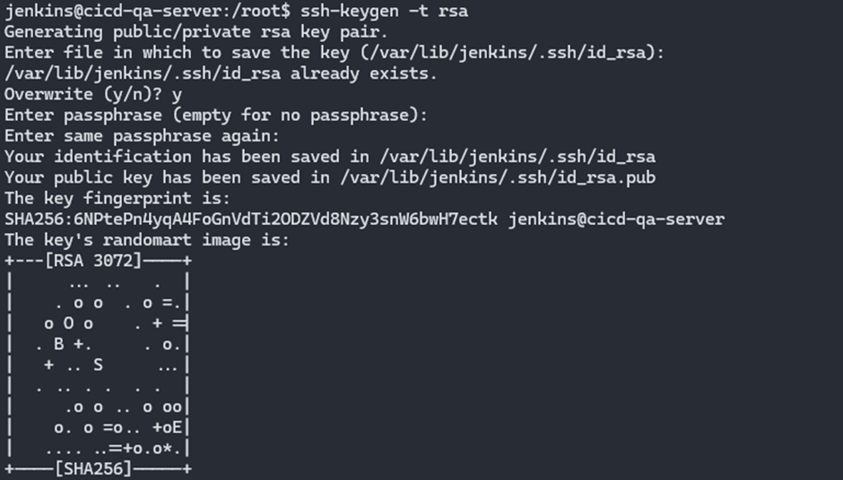
</div>
<br>

`ssh-copy-id -i ~/.ssh/id_rsa.pub tuan@192.168.64.142` copies the user's public key to the `app-server-1`. Do the same for `app-server-2`.

<div align="center">
  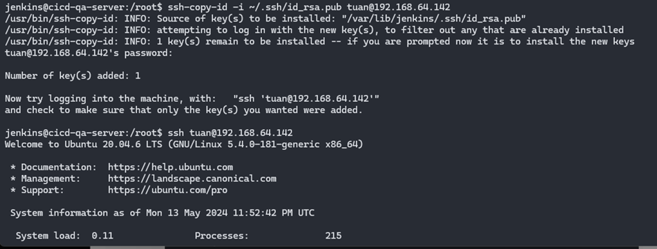
</div>
<br>

SSH from the Jenkins server to `app-server-1` without entering a password is successful.

<div align="center">
  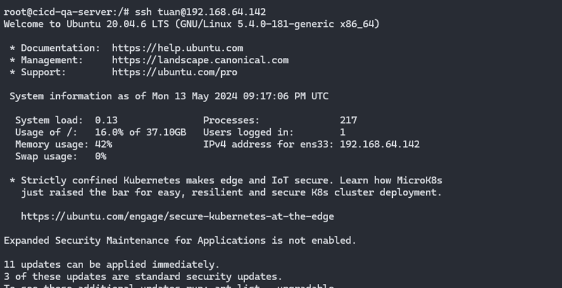
</div>
<br>

Save the private key and create a credential on the Jenkins server with that private key to use in the CI/CD pipeline.

<div align="center">
  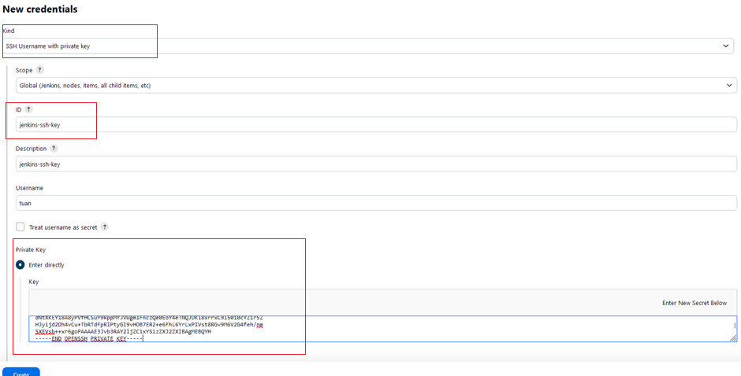
</div>
