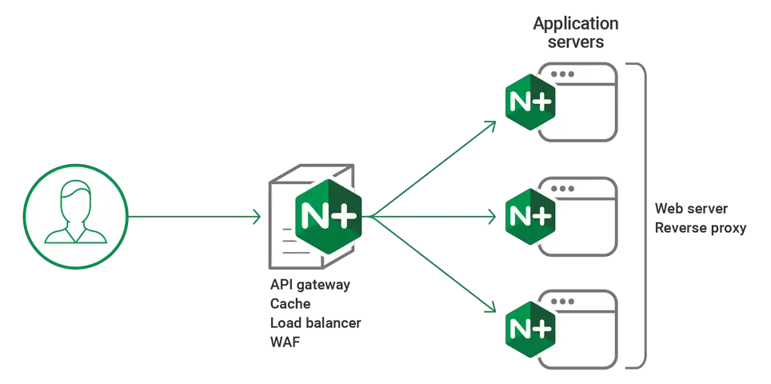
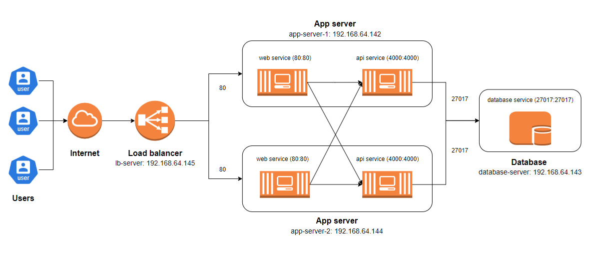

### Setup Nginx as a load balancer (lb-server: 192.168.64.145)

NGINX is a popular open-source software primarily used as a web server, reverse proxy, and load balancer. Developed by Igor Sysoev and first released in 2004, NGINX is known for its high performance, ability to handle many concurrent connections, and stability. Below are some details about NGINX and its role as a load balancer:

- Main functions of NGINX
  - Web server: NGINX can efficiently serve static files such as HTML, CSS, JavaScript, and images.
  - Reverse Proxy: NGINX can act as a reverse proxy, forwarding requests from users to servers, helping protect and hide the server from end-users.
  - Load Balancer: NGINX can distribute traffic to multiple servers to optimize resources and improve application performance.
  - Security: NGINX provides many security features such as IP blocking, rate limiting, and SSL/TLS termination.
  - Caching: NGINX supports caching to speed up web application responses.

<div align="center">
  
</div>
<br>

**NGINX as a Load Balancer**

A load balancer is an essential component in distributed systems, helping distribute traffic evenly to servers to ensure application performance and availability. NGINX can perform load balancing through the following methods:

Load balancing methods:

- Round Robin: The default method, distributing requests sequentially to each server.
- Least Connections: Distributes requests to the server with the fewest current connections, helping reduce the load on busy servers.
- IP Hash: Uses a hash of the client's IP address to determine the server, helping maintain user session persistence.
- Weight: Defines a weight for each server, with higher-weighted servers receiving more requests.

#### Install and configure NGINX as a load balancer

Install NGINX using the command `sudo apt install nginx`.
Change the content of the `nginx.conf` file in the `/etc/nginx/` directory.

**_Upstream_**

The upstream web and upstream api blocks define groups of servers for load balancing. These blocks specify the servers that will handle requests for each service.

- upstream web has two servers: `192.168.64.142:80` and `192.168.64.144:80`.
- upstream api has two servers: `192.168.64.142:4000` and `192.168.64.144:4000`.

**_Server_**

Defines a server listening on port 80.

- location `/`:

  - Handles all requests to the root URL.
  - proxy_pass `http://web;` forwards requests to the upstream web group.

- location `/api`:

  - Handles all requests to URLs starting with `/api`.
  - rewrite `^/api/(.*)$ /$1 break;`:
    - This rewrite rule removes `/api` from the request URI before forwarding it to the servers.
    - For example, a request to `/api/users/list` will be rewritten to `/users/list` before being forwarded.
  - proxy_pass `http://api;` forwards requests to the upstream api group.

```shell
events {

}
http {
    # Upstream server configuration for web service
    upstream web {
        server 192.168.64.142:80;
        server 192.168.64.144:80;
    }
    # Upstream server configuration for api service
    upstream api {
        server 192.168.64.142:4000;
        server 192.168.64.144:4000;
    }
    server {
        listen 80;
        # Configuration for web
        location / {
            proxy_pass http://web;
        }
        # Configuration for api
        location /api {
            rewrite ^/api/(.*)$ /$1 break;
            proxy_pass http://api;
        }
    }
}
```

With the above NGINX configuration, accessing `192.168.64.145` will be directed to `192.168.64.142` or `192.168.64.144`. Similarly, accessing `192.168.64.145/api` will be directed to `192.168.64.142:4000` or `192.168.64.144:4000`.

<br>
<div align="center">
  
</div>
<div align="center">
<i>
Load balancing schema
</i>
</div>
<br>
