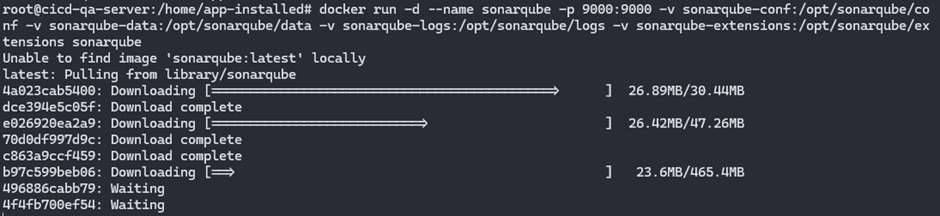
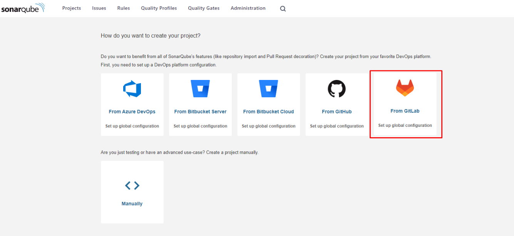
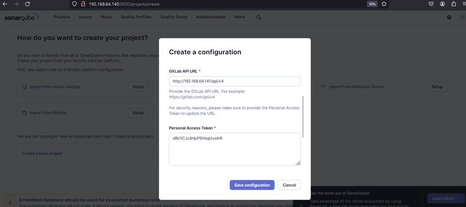
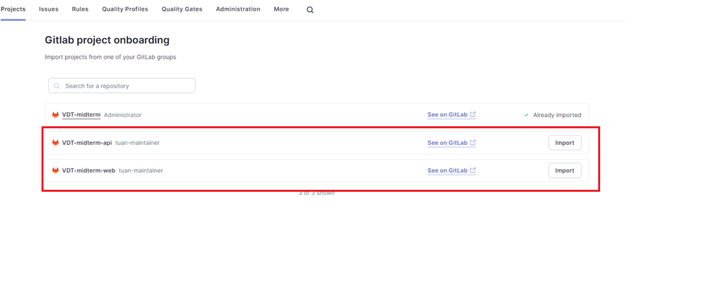
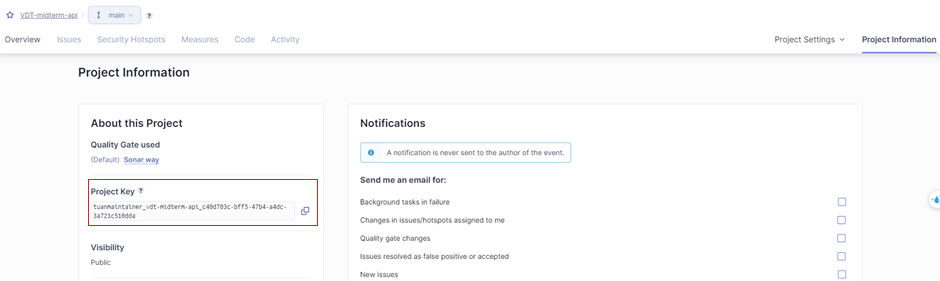
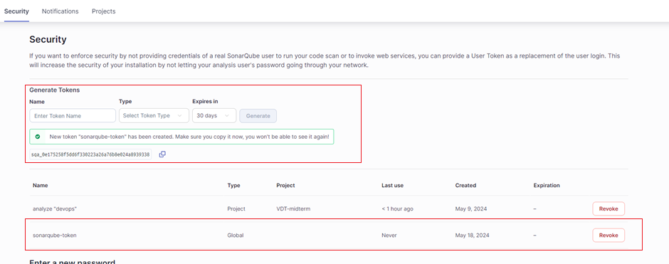

### Setup Sonarqube server (cicd-qa-server: 192.168.64.140) on port 9000

SonarQube is an open-source platform used for managing code quality, developed by SonarSource. It helps developers detect and fix bugs, security vulnerabilities, and code weaknesses. Below are some details about SonarQube:

Main functions:

- Source code analysis: SonarQube supports source code analysis for many programming languages such as Java, C#, JavaScript, TypeScript, Python, Go, and many others.
- Bug and security issue detection: SonarQube can detect programming errors, security vulnerabilities, performance issues, and areas in the code that can be improved.
- Code quality scoring: Based on analysis results, SonarQube provides metrics and reports on code quality such as Technical Debt, Code Coverage, and other indicators.
- CI/CD integration: SonarQube easily integrates with popular CI/CD systems like Jenkins, GitLab CI, Travis CI, CircleCI, helping automate the source code analysis process in software development pipelines.

  

 

#### Install Sonarqube

To run the Sonarqube server, execute the following command with docker:
`docker run -d --name sonarqube -p 9000:9000 -v sonarqube-conf:/opt/sonarqube/conf -v sonarqube-data:/opt/sonarqube/data -v sonarqube-logs:/opt/sonarqube/logs -v sonarqube-extensions:/opt/sonarqube/extensions sonarqube`

  

 

After successfully running the docker container, access the address `192.168.64.140:9000` to proceed with the initial setup steps for Sonarqube.

#### Create a project on Sonarqube from GitLab

  

 

For Sonarqube to connect to projects on GitLab, you need to enter two pieces of information:

- GitLab API URL: `http://192.168.64.141/api/v4` - the address of the GitLab server + `/api/v4`
- Personal Access Token: access token created on the GitLab server

  

 

Next, import the two projects `VDT-midterm-api` and `VDT-midterm-web`.

  

#### Get the project key of the projects on Sonarqube

Each project imported from GitLab into Sonarqube as above will have a unique project key.
To get the project key, select the project `Overview -> Project information`.

  

This project key will be used to create a credential on the Jenkins server to use in the CI/CD pipeline. It helps the CI/CD pipeline know which project's code to analyze.

#### Create a user token on the Sonarqube server

For Jenkins to run Sonarqube on the Jenkins server, a user token on Sonarqube is needed.
Select the `Security` tab and create a token.

  

 

This token will then be used to create a credential on the Jenkins server, allowing Jenkins to use Sonarqube in the CI/CD pipeline.
