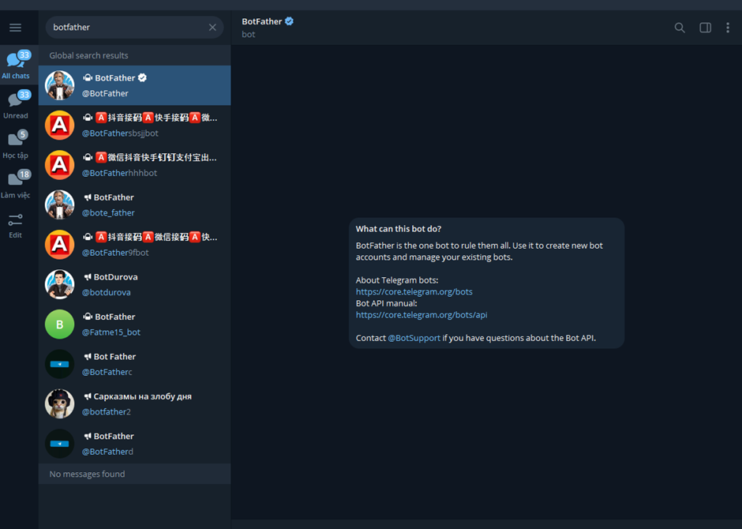
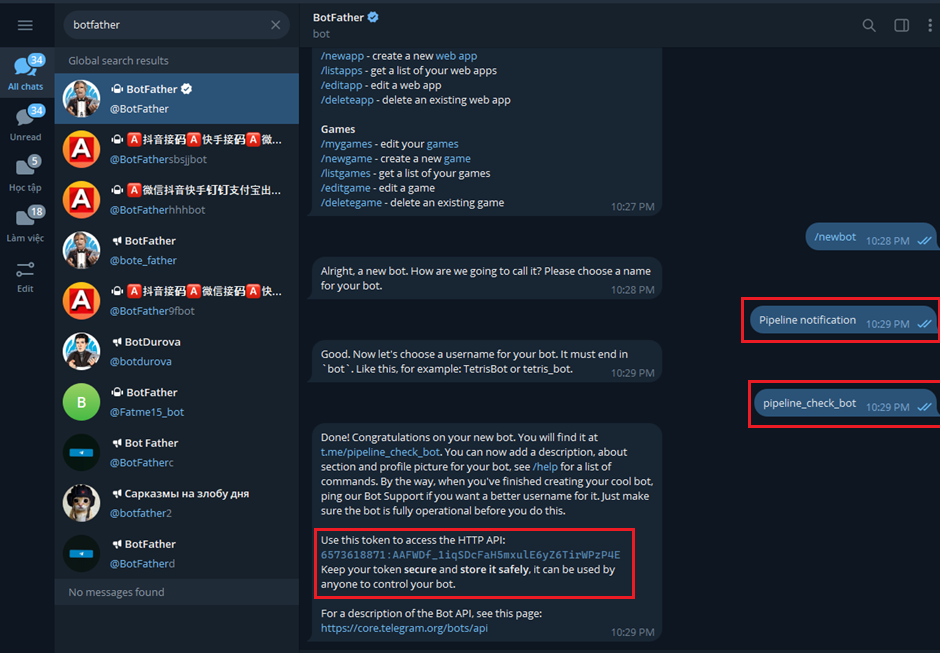
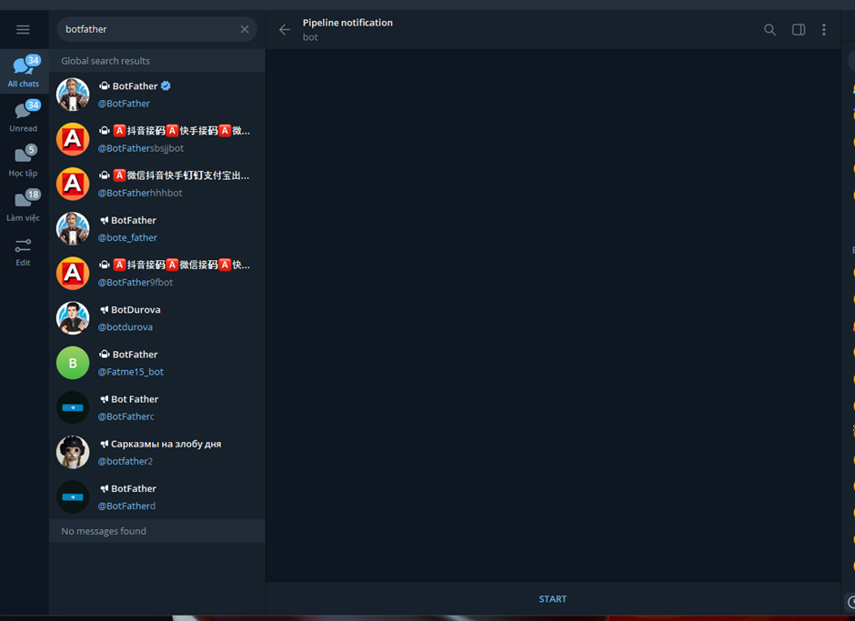
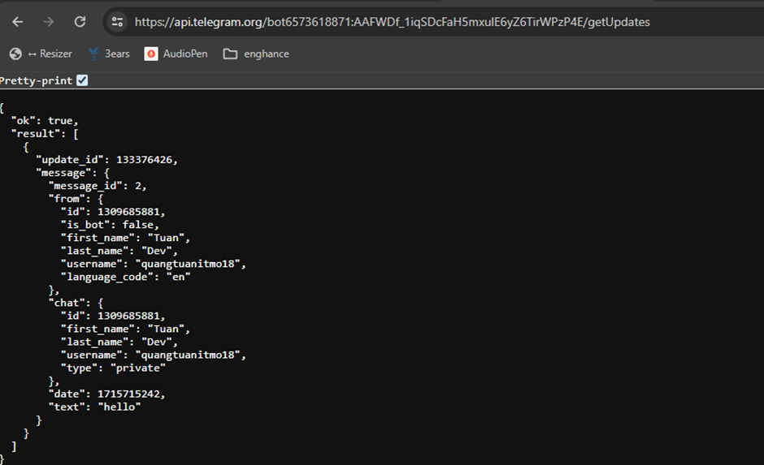

## Integrate sending CI/CD Pipeline notifications to Telegram

Search for botfather on Telegram

  

 

Follow the steps guided by `BotFather` to create a new bot, choose a `name` and `username` for the bot

- `name`: `Pipeline notification`
- `username`: `pipeline_check_bot`

After successful creation, you will have:

- A link to the bot conversation
- A token, save it for later use in the CI/CD pipeline

  

 

Go to the newly created bot, press `Start`, and send any message

  

 

Access the link: `https://api.telegram.org/bot<Token>/getUpdates` and save the Chat ID for use in the CI/CD pipeline

  

 
