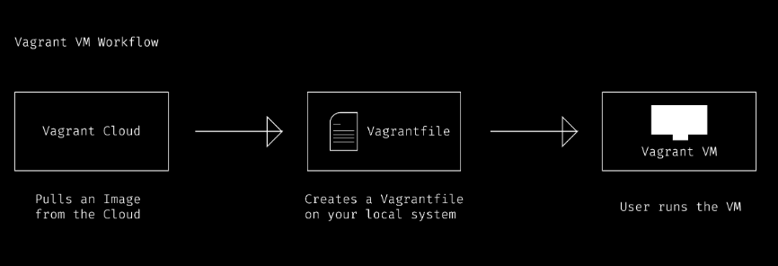
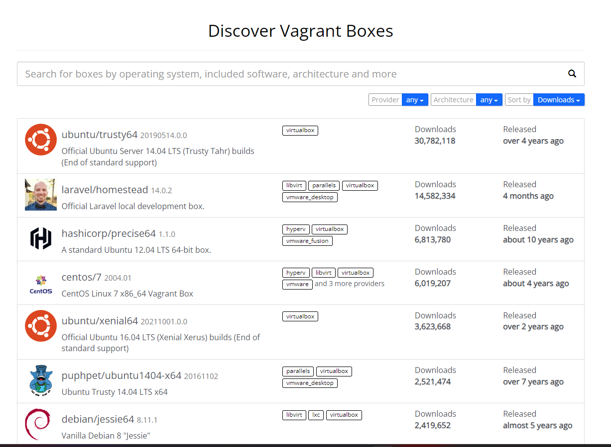
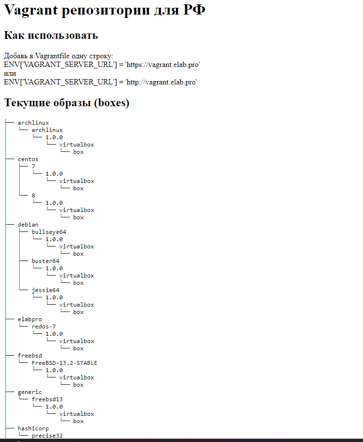

## Use Vagrant to create a virtual machine

Vagrant is an open-source tool developed by HashiCorp, designed to manage and automate the deployment of development environments using virtual machines or containers. It allows developers to build, share, and maintain consistent and easily reproducible development environments across multiple systems.

Below are some key features of Vagrant:

- Automated environment deployment: Vagrant allows you to describe your development environment in a simple configuration file using Ruby called Vagrantfile. This way, you can define how your environment is configured, including virtual machines, software installations, and network configurations.

- Compatibility with multiple virtualization providers: Vagrant supports many virtualization providers such as VirtualBox, VMware, Hyper-V, Docker, and more. This allows you to deploy development environments on multiple platforms without relying on a specific virtualization system.

- Managing boxes: Vagrant uses "boxes" as the basis for creating virtual machines. A box is a pre-configured virtual machine image that includes the operating system and necessary software. The Vagrant community provides many available boxes for various development environments.

- Easy to use and configure: Vagrant provides a range of easy-to-use commands to manage virtual machines and development environments. You can create, start, stop, and delete virtual machines easily from the command line.

  

<i>Vagrant VM Workflow</i>

 

To install a virtual machine from Vagrant, you first need to install `vagrant` and `virtualbox` on your machine.

Configure the virtual machine based on [Vagrantfile](../scripts/Vagrantfile), then run the command `vagrant up` to initialize the virtual machine.

By default, Vagrant boxes are fetched from [Vagrant cloud](https://app.vagrantup.com/boxes/search), but countries that are banned from using it (e.g., Russia) cannot access these resources. To overcome this, you can use other resources like `https://vagrant.elab.pro/downloads/`. You need to add the config line `ENV['VAGRANT_SERVER_URL'] = 'https://vagrant.elab.pro'` to the `Vagrantfile`.

  

<i>Vagrant cloud</i>

 

  

 

Commonly used Vagrant commands:

- `vagrant init`: create a new Vagrantfile

- `vagrant up`: create the virtual machine

- `vagrant ssh`: access the virtual machine

- `vagrant halt`: stop the virtual machine (shutdown)

- `vagrant reload`: restart the virtual machine and update the configuration from the Vagrantfile (when changing machine configuration)

- `vagrant destroy`: delete the virtual machine
