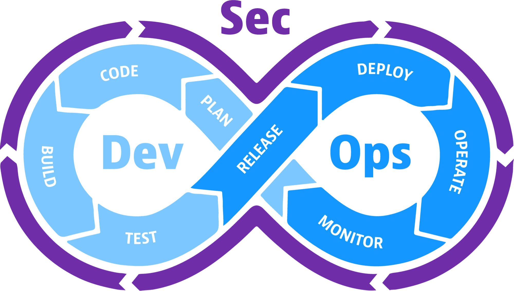
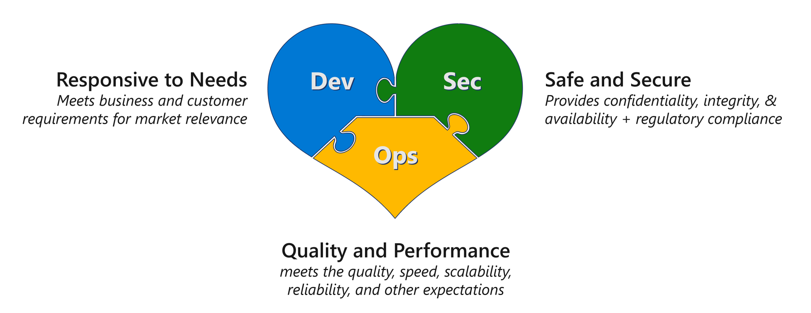
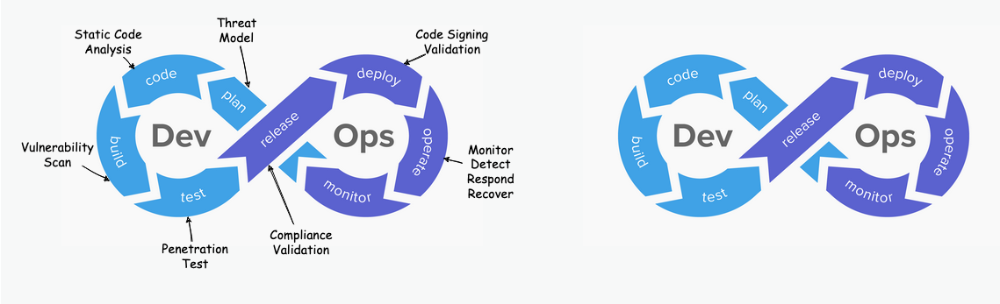
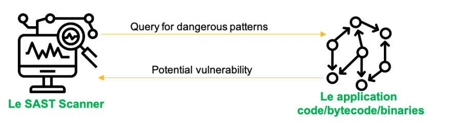
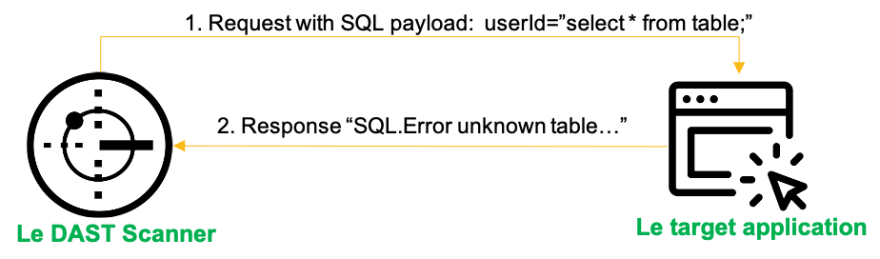
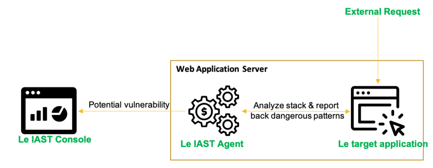
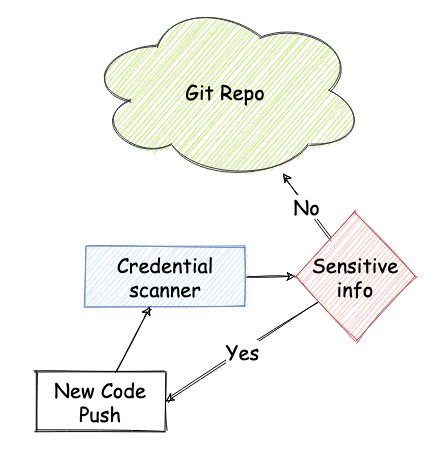
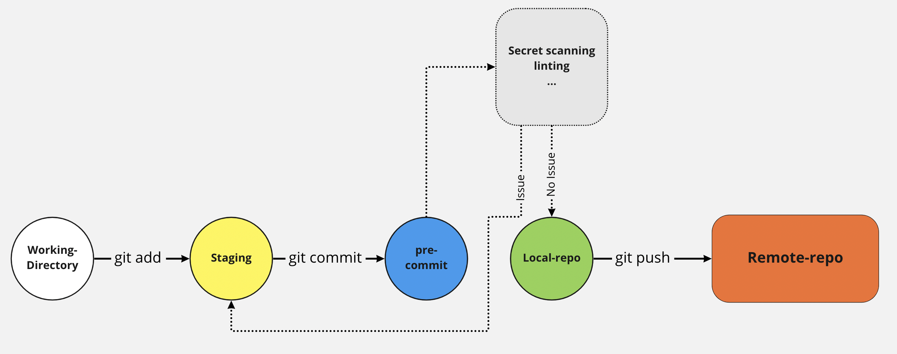
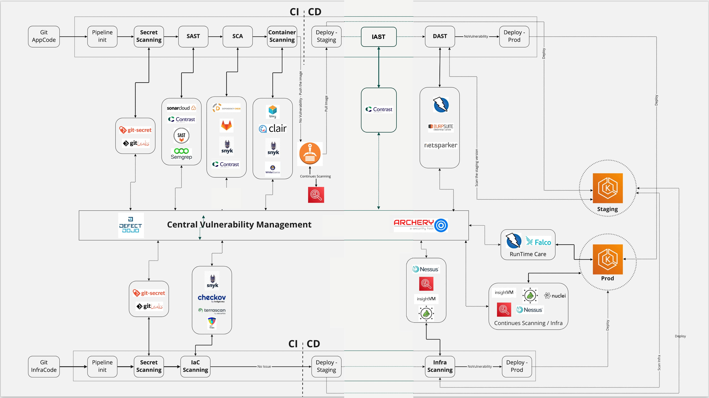

# DevSecOps

## 1. Introduction to DevSecOps

### 1.1 Concept and Benefits of DevSecOps

DevSecOps, short for Development, Security, and Operations, is an approach to application development that integrates security into DevOps processes from the very beginning of the development lifecycle.

  

  <i><a href="https://www.dynatrace.com/news/blog/what-is-devsecops/">DevSecOps</a></i>

 

The objective of DevSecOps is to automate, monitor, and incorporate security at every stage of the software development process—from planning, development, building, testing, releasing, distributing, deploying, operating, to monitoring. Integrating security throughout the development process supports CI/CD, reduces costs, and accelerates delivery.

### 1.2 Comparison Between DevOps and DevSecOps

DevSecOps integrates the organization’s security team into the traditional DevOps framework. While DevOps unites production and development teams to create error-free applications, DevSecOps adds an extra step to ensure those applications are secure.

DevOps and DevSecOps are not mutually exclusive. Organizations can adopt DevOps and gradually transition to DevSecOps as security becomes a higher priority.

Achieving the right balance between collaboration, efficiency, and security is key to unlocking the full potential of software development processes and delivering safe, high-quality solutions.

### 1.3 The Importance of Security in Modern Software Development

Today, most businesses aspire to digital transformation, which often involves three critical elements: a plethora of applications, cloud technology, and cybersecurity practices (DevOps).

Having numerous applications increases risks during digital transformation, requiring advanced technical expertise and robust application security to protect digital assets.

Cloud technology introduces its own set of challenges—rapid changes, public accessibility, and significant IT and infrastructure concerns—making access control and licensing critical.

DevOps accelerates both development and delivery, empowering application teams to continuously and rapidly deliver software, make automated deployment decisions, and bypass intermediaries. However, as the rest of the organization evolves, the security team faces major challenges. A shortage of resources for secure software development can lead to vulnerabilities and expose the enterprise to risks. DevSecOps was created to address these challenges by embedding security throughout the DevOps process, enabling development teams to secure what they build at every stage, while fostering better collaboration between developers and security teams. This integration empowers security teams to support, share expertise, and provide tools to boost developer autonomy—while ensuring appropriate oversight. The integration of DevSecOps with DevOps helps developers, network administrators, and others to focus on security just as much as on development and deployment.

## 2. Integrating Security into DevOps

Today, as technology evolves daily, DevOps is widely and rapidly adopted by tech companies, with production environments transforming at high speeds. Time-to-delivery becomes critical in this process, prompting security experts to ask, "How can we ensure this process is secure?" or "How secure are the delivered products?"

To address this, we must integrate security into the entire DevOps lifecycle to automatically test and evaluate every security step. Therefore, adopting a DevSecOps culture helps ensure that the planned shift-left strategy is implemented throughout the product lifecycle.

  

### 2.1 The Shift-Left Security Strategy

The shift-left security strategy is an approach to embed security into our product development process by establishing security checkpoints from the very beginning of the application development or system design phase. The purpose of DevSecOps is built on the premise that **"everyone is responsible for security"** with the goal of distributing automated security checks throughout the process to achieve an appropriate level of protection.

### 2.2 Building a DevSecOps Culture

Imagine working in a DevOps team that still conducts traditional security testing. The process might require that a product pass all QA tests, the development team then fixes the bugs identified, then security testing takes place, followed by another round of QA and security retesting. This approach is time-consuming, costly, and can trap teams in iterative loops, sometimes even sacrificing certain stages to meet business demands.

The solution is to adopt a shift-left strategy—consider security from the design phase—so that security measures are implemented as early as possible, reducing costs and time in later stages.

  

#### 2.2.1 Privacy

Privacy has become a major concern for companies of all sizes, especially since personal data is governed by international standards such as GDPR (General Data Protection Regulation) in Europe, CCPA (California Consumer Privacy Act), Brazil’s LGPD, and various other laws and regulations being enforced worldwide. Applications that handle large volumes of Personally Identifiable Information (PII) require us to design our DevSecOps processes to prevent violations of privacy policies throughout the product lifecycle.

#### 2.2.2 Software Testing Strategies

**Positive Testing**

Performed under normal conditions with expected inputs, where everything functions as intended. It assumes that only valid and relevant actions occur: datasets and functionalities behave as expected.

**Negative Testing**

Performed to assess system behavior under unexpected conditions. Negative testing is crucial in high-performance software development as it evaluates how the system reacts to abnormal conditions and inputs.

#### 2.2.3 Software Testing Methods

**Static Testing**

Static testing involves examining the software for errors without executing the application code. Conducted early in the development cycle, it helps to catch errors sooner since it is easier to locate and fix issues in source code. Some problems that are not detected during dynamic testing may be easily discovered through static analysis, such as outdated encryption methods, the absence of encryption algorithms, weak random functions, etc. Most static analysis tools are limited to testing a subset of the source code.

  

**Dynamic Testing**

Dynamic testing analyzes the application's behavior during runtime. Tools send scripted requests to probe the target application. During testing, input parameters are continuously modified to uncover a range of vulnerabilities. Based on the application's feedback, the tool can identify and report potential vulnerabilities. Issues that may not be caught by static analysis—such as client-side vulnerabilities like session handling flaws or plain-text transmission of sensitive data—can be effectively detected during dynamic testing. Dynamic analysis tools can inspect the entire application flow (multiple components simultaneously).

  

**Interactive Analysis**

Also known as Interactive Application Security Testing (IAST), this approach monitors the application while other systems interact with it, detecting vulnerabilities in real-time. Sensors can trace the full flow from the HTTP request down to the executed code, monitoring data throughout the application. Similar to static analysis, it can inspect one component at a time, but not multiple components simultaneously.

  

 

## 3. Ensuring Sensitive Information Is Not Exposed in the Project's CI/CD Lifecycle

This is one of OWASP's prioritized issues, and several bug bounty reports have highlighted problems such as hardcoded user credentials, passwords, or API keys in production environments due to oversight or lack of awareness of the dangers.

It is essential to ensure that your repository does not contain—and actively detects—any sensitive information such as passwords, secret keys, tokens, etc., following a process such as outlined below.

  

Detection and prevention of sensitive data leaks should occur before the data is committed to the code repository, as it could later be exposed through tools that archive website history.

In cases where certain source code hosting platforms may still have secret information lingering on the web even after removal from the repository, it is important to ensure that the information is deactivated and rendered invalid.

Sensitive information should be detected at several stages:

- **Detect sensitive information within the repository (hardcoded in the source code)**
- **Use pre-commit hooks to prevent exposing cleartext data in code**
- **Detect sensitive data in pipeline logs that are not encrypted**
- **Perform secret scanning before pushing to the repository to ensure that data is masked and encrypted end-to-end throughout the process**

  

### 3.1 Vulnerability Management Tools

Vulnerability management is a process within CI/CD that helps organizations detect, report, prioritize, and remediate vulnerabilities in their software and infrastructure. It is a critical part of the DevSecOps lifecycle because it aggregates security vulnerabilities in a manageable way and facilitates remediation actions throughout the product lifecycle.

- [gittyleaks](https://github.com/kootenpv/gittyleaks) - Searches for sensitive information in a git repository
- [git-secrets](https://github.com/awslabs/git-secrets) - Prevents committing secrets and credentials into git repositories
- [Repo-supervisor](https://github.com/auth0/repo-supervisor) - Scans code for misconfigurations in security, searching for passwords and secrets
- [truffleHog](https://github.com/trufflesecurity/trufflehog) - Searches through git repositories for high entropy strings and secrets, delving into commit history
- [Git Hound](https://github.com/ezekg/git-hound) - A git plugin that prevents sensitive data from being committed
- [Github Secret Scanning](https://docs.github.com/en/code-security/secret-scanning) - GitHub's built-in secret detection feature

### 3.2 How Vulnerability Management Tools Work

- **Detection:** In the detection phase, tasks are performed to identify vulnerabilities by determining: who, what, where, when, why, and how. Key activities focus on defining and refining the scope after each iteration of the process, preparing and verifying integrity, conducting tests, and confirming results.
- **Reporting:** The reporting phase focuses on capturing and communicating all relevant details about systems, vulnerabilities, security threats, technical risks, and operational risk factors in a measurable way.
- **Prioritization:** This process involves selecting which vulnerabilities to address and working with development teams to remediate them. Some vulnerabilities may pose minimal risk or be unexploitable. Risk is a key factor here, along with the effort and expertise required for remediation.
- **Remediation:** The remediation phase focuses on defining priorities and timelines for fixing issues, discussing and documenting any false positives, and handling exceptions.

### 3.3 How to Use Vulnerability Management Tools in DevSecOps

- Tools implemented in a DevSecOps process will generate numerous vulnerability reports, each with its own format.
- Vulnerability management tools consolidate reports generated by various tools and activities into one or several dashboards.

Team members can monitor remediation progress through metrics, classify and prioritize findings across the process, and manage the entire vulnerability lifecycle.

Finally, these tools offer integrations with other components to enable two-way communication, notifications, data export, and reporting.

  

